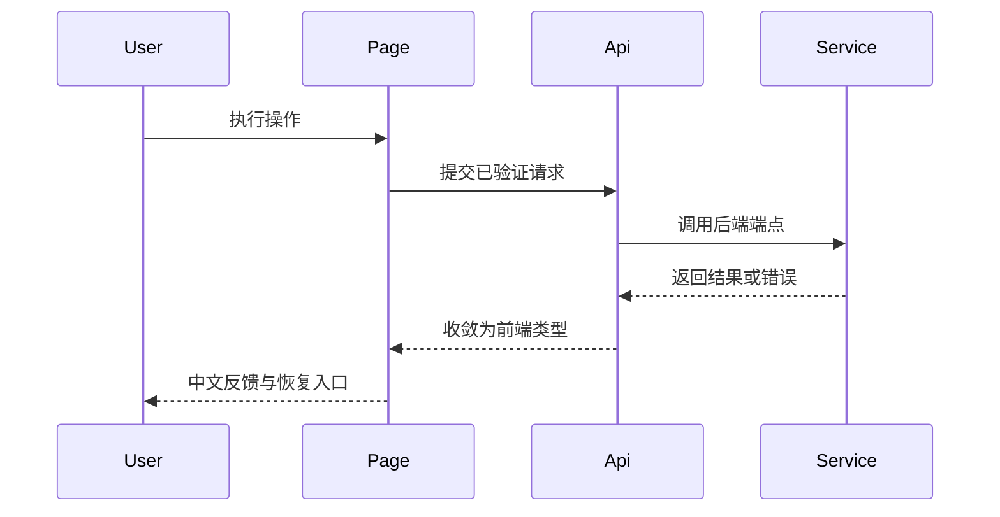

# 太初前端设计章节模板

## 使用条件

规格涉及 `web/` 下页面、组件、布局、样式、交互、动效、API、类型或用户可见文案时必须包含本章节。无 UI 变更时可省略。

填写前必须读取：

- 根 `AGENTS.md`；
- 根 `DESIGN.md`；
- `.agents/skills/taichu-ui-components/SKILL.md`；
- `references/rules/frontend-exploration-rules.md`；
- 实际页面、组件、API、类型和测试。

当前技术栈：Next.js App Router + React + TypeScript + shadcn/ui + Tailwind CSS。只设计桌面浏览器，不添加移动端或窄屏适配。

新增页面原则上填写全部 10 个子章节；修改页面可裁剪与变更无关的 5、6、8、9，但必须保留 1–4、7、10。

# 前端设计

## 1. 页面与导航

### 页面清单

| 页面名称 | 路由 | 入口文件 | 业务组件 | 变更类型 | 页面模式 |
|---|---|---|---|---|---|
| {{PAGE_NAME}} | `/{{ROUTE}}` | {{ENTRY_FILE}} | {{FEATURE_SHELL}} | {{CHANGE}} | {{PAGE_MODE}} |

页面模式填写：工作台、编辑、资料与知识、对话与智能体中的适用项。

### 导航关系

| 项目 | 当前事实 | 本次设计 |
|---|---|---|
| 根路径 | `/` 跳转 `/home` | 保持/说明变更理由 |
| 导航项 | `web/src/lib/app-shell-navigation.ts` | {{NAV_CHANGE}} |
| 应用壳 | `web/src/components/app-shell.tsx` | {{SHELL_CHANGE}} |
| 页面标题/操作区 | {{CURRENT}} | {{DESIGN}} |

### 边界

- 本页面负责：{{OWNERSHIP}}
- 本页面不负责：{{OUT_OF_SCOPE}}
- 相邻页面/后端前提：{{ADJACENT_EXPECTATION}}

## 2. 组件结构与职责

### 组件树

```text
web/src/app/{{ROUTE}}/page.tsx
└── {{FEATURE_SHELL}}
    ├── {{HEADER_OR_TOOLBAR}}
    ├── {{DOMAIN_PANEL}}
    │   ├── {{REUSED_UI_COMPONENT}}
    │   └── {{FEATURE_COMPONENT}}
    └── {{FEEDBACK_STATE}}
```

### 组件职责

| 组件 | 现有/新增 | 文件 | 单一职责 | Props/回调 | 状态所有权 | 需求 |
|---|---|---|---|---|---|---|
| {{COMPONENT}} | 现有/新增 | `{{PATH}}` | {{RESPONSIBILITY}} | {{CONTRACT}} | {{STATE_OWNER}} | {{IDS}} |

### 共享契约

重复 UI 组件优先引用共享 props/type，不重复定义。新边界必须给出精确 TypeScript 类型；禁止 `any`。

```ts
interface {{ComponentName}}Props {
  {{field}}: {{Type}};
  on{{Action}}: (input: {{InputType}}) => void;
}
```

## 3. 组件复用与准入

按 `taichu-ui-components` Skill 记录：

| 需求 | 候选组件 | 来源 | 复用/新增 | 决策理由 | 拒绝方案 |
|---|---|---|---|---|---|
| {{UI_NEED}} | {{COMPONENT}} | 项目现有 / shadcn/ui / motion primitive | {{DECISION}} | {{REASON}} | {{REJECTED}} |

约束：

- 先项目现有组件，再 shadcn/ui。
- 动效/视觉效果必须服务状态、层级或反馈。
- 不建立平行设计系统。
- 若引入依赖，说明版本、维护、许可、包体和替代方案。
- 删除/替换组件时说明旧组件、样式、依赖和测试清理。

## 4. API 与类型契约

### API 映射

| 前端函数 | 文件 | HTTP | 后端端点 | 请求类型 | 响应类型 | 错误形状 | 变更 |
|---|---|---|---|---|---|---|---|
| {{API_FUNCTION}} | {{API_FILE}} | {{METHOD}} | {{ENDPOINT}} | {{REQUEST}} | {{RESPONSE}} | {{ERROR}} | {{CHANGE}} |

### 类型

类型位于 `web/src/lib/types/{{domain}}.ts` 或与当前项目模式一致的位置。

```ts
export interface {{RequestType}} {
  {{field}}: {{Type}};
}

export interface {{ResponseType}} {
  {{field}}: {{Type}};
}

export type {{StateType}} =
  | { status: "idle" }
  | { status: "loading" }
  | { status: "success"; data: {{ResponseType}} }
  | { status: "error"; message: string };
```

### 对接检查

- [ ] 前端函数与 FastAPI 路由一一对应。
- [ ] 请求/响应字段、可空性和枚举一致。
- [ ] 边界输入已验证或收窄。
- [ ] 内部英文状态已映射为中文用户文案。
- [ ] loading/empty/error/success 均有表现。
- [ ] 删除后普通列表、筛选、搜索和默认视图排除已删除条目。

## 5. 页面布局与信息层级

### 页面模式

选择 `DESIGN.md` 中的模式：

- 控制台工作台；
- 写作与编辑；
- 资料与知识；
- 对话与智能体协作。

### 布局区块

| 区块 | 内容 | 层级 | 宽度/对齐 | 滚动归属 | 边界与背景 |
|---|---|---|---|---|---|
| {{SECTION}} | {{CONTENT}} | 主/次/辅助 | {{LAYOUT}} | 页面/区域/无 | {{VISUAL_BOUNDARY}} |

说明：

- 信息密度与功能显隐；
- 首要操作和次要操作；
- 空状态、错误状态和长内容；
- 编辑器/监控图/列表等专门区域的滚动和尺寸；
- 不设计移动端重排。

可用紧凑 ASCII 线框表达关系，但不得用线框替代视觉规则：

```text
┌─ 应用壳 ─────────────────────────────────────────┐
│ 页面标题                         主要操作         │
├──────────────────────────────────────────────────┤
│ 主内容区                          辅助面板         │
│                                                  │
└──────────────────────────────────────────────────┘
```

## 6. 状态模型

| 状态 | 所有者 | 初始值 | 触发 | 派生状态 | 持久化 | 清理/取消 |
|---|---|---|---|---|---|---|
| {{STATE}} | 页面/组件/服务端 | {{INITIAL}} | {{TRIGGER}} | {{DERIVED}} | 无/URL/服务端 | {{CLEANUP}} |

必须覆盖：

- 初始；
- 加载；
- 空；
- 成功；
- 错误；
- 重试/恢复；
- 禁用/防重复提交；
- 取消、切换或卸载竞态；
- 需要时的乐观更新和回滚。

不为当前需求引入无必要的全局状态库。

## 7. 交互与事件流程

### 事件表

#### {{ACTION}}

- 触发组件：{{COMPONENT}}
- 前置条件：{{PRECONDITION}}
- 状态变化：{{STATE_CHANGE}}
- API/副作用：{{SIDE_EFFECT}}
- 成功反馈：{{SUCCESS}}
- 失败/恢复：{{FAILURE}}
- 需求：{{IDS}}

### 关键流程

复杂流程使用纯 Mermaid；简单流程使用步骤列表，不重复描述图中内容。



明确：

- 防重复提交；
- 超时/取消；
- 并发冲突；
- 保存后的刷新或局部更新；
- 删除后的列表排除；
- 路由切换时未完成请求处理。

## 8. 视觉与文案

### Token 与层级

只引用 `DESIGN.md` 的当前 token 和规则：

| 元素 | 设计 |
|---|---|
| 画布 | 炭灰主画布 |
| 导航/结构 | 深色导航条、灰色线框 |
| 主要操作 | 白色胶囊按钮 |
| 装饰 | 极光渐变仅少量使用 |
| 卡片/输入/标签 | 按 `DESIGN.md` 对应章节 |

不要在本模板硬编码一套新颜色、阴影、圆角或字体系统。

### 文案

| 场景 | 中文文案 | 内部状态/错误 | 行动性 |
|---|---|---|---|
| {{SCENE}} | {{COPY}} | {{INTERNAL_CODE}} | {{NEXT_ACTION}} |

约束：

- 所有按钮、卡片、提示、错误、空状态和帮助文案中文；
- 不直接显示内部枚举、异常或英文 key；
- 错误信息说明发生了什么和用户能做什么；
- 危险操作的确认文案明确对象和后果。

## 9. 动效、可访问性与性能

### 动效

| 元素 | 目的 | 现有原语 | 时机 | 降级/禁止 |
|---|---|---|---|---|
| {{ELEMENT}} | 状态/层级/反馈 | {{PRIMITIVE}} | {{TRIGGER}} | {{BOUNDARY}} |

动效不得成为主要操作的前置条件，也不得造成持续视觉噪音。

### 可访问性

- 键盘焦点顺序；
- 语义元素与标签；
- 弹层焦点管理；
- 颜色对比；
- 图标的可读名称；
- loading/error 的可感知反馈。

### 性能

只记录本功能特定事项：

- 大列表/图/编辑器渲染；
- 请求去重和竞态；
- 必要的懒加载；
- 避免无依据的微优化；
- 测量方法。

## 10. 文件、测试与验收

### 文件规划

| 文件 | 新增/修改/删除 | 职责 | 需求 |
|---|---|---|---|
| `web/src/...` | {{CHANGE}} | {{RESPONSIBILITY}} | {{IDS}} |

### 自动验证

| 层级 | 命令/测试 | 覆盖行为 |
|---|---|---|
| 类型/视图模型 | {{COMMAND}} | {{BEHAVIOR}} |
| API 适配 | {{COMMAND}} | {{BEHAVIOR}} |
| 组件/交互 | {{COMMAND}} | {{BEHAVIOR}} |
| lint/build | {{COMMAND}} | {{BEHAVIOR}} |

命令必须来自当前 `web/package.json` 或项目配置，不得发明。

### 手动验收

固定入口：

- 前端：`http://localhost:3000`
- 后端：`http://127.0.0.1:8000`

步骤：

1. 启动前探测固定端口；正常本项目服务直接复用。
2. 打开 `http://localhost:3000/{{ROUTE}}`。
3. 验证 {{PRIMARY_FLOW}}。
4. 验证 loading/empty/error/recovery。
5. 验证删除/筛选/搜索等边界行为。
6. 验证中文文案、导航、视觉层级和桌面布局。
7. 记录实际结果与截图/证据（需要时）。

不得换到 3001/8001 等端口规避问题。
