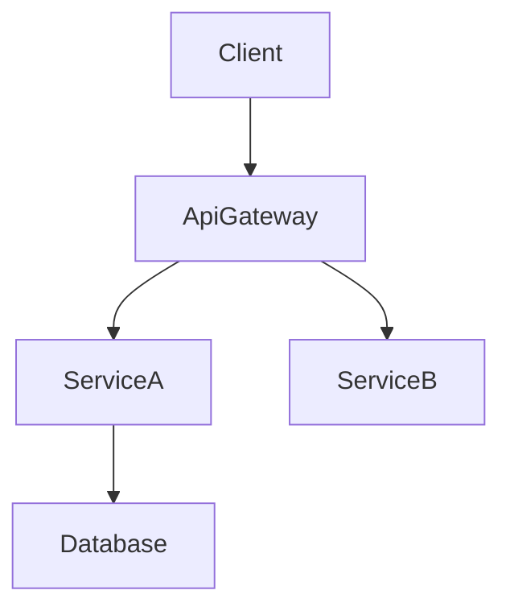

# 技术设计规则与原则

## 核心设计原则

### 0. 边界优先

边界是强制的；所有者是可选的  
设计在解释组件之前，必须先明确责任分界  
在阐述工作原理之前，先定义本规格负责的范围  
明确记录哪些内容不在边界内  
不要将下游特定的行为或假设泄露到上游边界  

### 1. 类型安全是强制的

禁止在接口中使用 any 类型  
为所有参数和返回值定义显式类型  
使用区分联合类型进行错误处理  
明确泛型约束  

### 2. 设计与实现分离

关注 WHAT，而非 HOW  
定义接口和契约，而非代码  
通过前置/后置条件指定行为  
记录架构决策，而非算法  

### 3. 可视化沟通

简单功能：基础组件图或不使用图  
中等复杂度：架构图 + 数据流  
高复杂度：多图（架构、时序、状态）  
始终使用纯 Mermaid：无自定义样式，仅结构  

### 4. 组件设计规则

单一职责：每个组件一个明确用途  
清晰边界：明确的领域所有权  
边界承诺优先：在详细说明组件之前，声明本设计承诺的责任边界  
依赖方向：遵循架构分层  
接口隔离：最小化、聚焦的接口  
团队安全接口：设计的边界允许并行实现而不产生合并冲突  
无隐式共享所有权：如果两个区域看似共同拥有同一行为或数据，则设计不完整  
研究可追溯性：在 research.md 中记录边界决策和理由  

### 5. 数据建模标准

领域优先：从业务概念出发  
一致性边界：清晰的聚合根  
规范化：在性能和完整性之间取得平衡  
演进性：为模式变更做好规划  

### 6. 错误处理哲学

快速失败：尽早且清晰地验证  
优雅降级：部分功能优于完全失败  
用户上下文：可操作的错误消息  
可观测性：全面的日志记录和监控  

### 7. 集成模式

松耦合：最小化依赖  
契约优先：先定义接口，后实现  
版本管理：规划 API 演进  
幂等性：设计重试安全性  
契约可见性：在 design.md 中展示 API 和事件契约，同时从 research.md 链接扩展细节  

### 8. 依赖方向

在 design.md 的架构章节中定义并强制执行依赖方向（例如：Types → Config → Repository → Service → Runtime → UI）  
每一层只能从左侧层导入——绝不向上依赖  
此约束不是建议；实现和审查应将违反视为错误  
当文件结构规划将文件映射到组件时，依赖方向决定了允许哪些导入  

## 文档标准

### 语言和语气

声明式：用"系统验证用户"而非"系统应该验证用户"  
精确：使用具体技术术语，而非模糊描述  
简洁：只提供必要信息  
正式：专业技术写作风格  

### 结构要求

层次化：清晰的章节组织  
可追溯：需求到组件的映射  
完整：涵盖实现的所有方面  
一致：全文使用统一的术语  
聚焦：保持 design.md 专注于架构和契约；将调查日志和冗长对比移至 research.md  

### 章节编写指南

### 全局顺序

默认流程：概述 → 目标/非目标 → 边界承诺 → 架构 → 文件结构规划 → 组件与接口 → 可选章节。  
团队可以调整可追溯性章节的位置或将数据模型靠近架构以提高清晰度，但保持章节标题不变。  
每个章节内部遵循 摘要 → 范围 → 决策 → 影响/风险，以便审阅者统一扫描。  

### 需求 ID

引用需求时使用 2.1, 2.3 格式，不带前缀（不要写"需求 2.1"）。  
所有需求必须有数字 ID。如果需求缺少数字 ID，停止并修复 requirements.md 后再继续。  
使用 N.M 格式的数字 ID，其中 N 是 requirements.md 中的顶级需求编号（例如：需求 1 → 1.1, 1.2；需求 2 → 2.1, 2.2）。  
每个组件、任务和可追溯性行必须引用相同的规范数字 ID。  

## 技术栈

仅包含受本功能影响的层（前端、后端、数据、消息、基础设施）。  
每层指定工具/库 + 版本 + 角色；将扩展理由、对比或基准推送到 research.md。  
扩展现有系统时，突出与当前技术栈的差异，并列出新依赖。  

## 系统流程

仅在图表能澄清行为时添加：  
时序图用于多步交互  
流程/状态图用于分支规则或生命周期  
数据/事件图用于管道或异步模式  
始终使用纯 Mermaid。如果无复杂流程，省略整个章节。  

### 需求可追溯性

使用标准表格（需求 | 摘要 | 组件 | 接口 | 流程）证明覆盖。  
仅当单个需求 1:1 映射到组件时，才使用子弹形式。  
简单映射优先使用组件摘要表；完整可追溯性表保留给复杂或合规敏感的需求。  
需求或组件变更时重新运行此映射以避免偏差。  

### 组件与接口编写

边界承诺应在本章节开始前已明确所有权分界。  
按领域/层分组组件，每个组件提供一个块。  
以摘要表开头，列出组件、领域、意图、需求覆盖、关键依赖和选定的契约。  
表格字段：意图（一行）、需求（2.1, 2.3）、所有者/审阅者（可选）。  
依赖表必须将每个条目标记为入站/出站/外部，并分配关键性（P0 阻塞、P1 高风险、P2 信息性）。  
外部依赖研究的摘要保留在此；详细调查（API 签名、速率限制、迁移说明）属于 research.md。  
design.md 必须是自包含的审阅工件。仅在背景方面引用 research.md，并在此重述结论和决策。  
契约：仅勾选相关类型（服务/API/事件/批处理/状态）。未勾选的类型不应出现在组件章节中。  
服务接口必须声明方法签名、输入/输出和错误信封。API/事件/批处理契约需要模式表或子弹列表，涵盖触发器、载荷、交付、幂等性。  
使用集成与迁移说明、验证钩子和待决问题/风险记录发布策略、可观测性和未解决的决策。  
详细密度规则：  
完整块：引入新边界的组件（逻辑钩子、共享服务、外部集成、数据层）。  
仅摘要：无新边界的展示/UI 组件（必要时附简短实现说明）。  
实现说明必须将集成/验证/风险合并为单个子弹子章节，减少重复。  
短数据（依赖、契约选择）优先使用列表或行内描述。仅在对比多个项时使用表格。  

### 共享接口与属性

为重复出现的 UI 组件定义基础接口（如 BaseUIPanelProps），每个组件扩展以捕获增量。  
引入新契约的钩子、工具类和集成适配器仍应包含完整的类型签名。  
复用基础契约时，显式引用（如"扩展 BaseUIPanelProps，添加 onSubmitAnswer 回调"），而非重复代码块。  

## 数据模型

领域模型覆盖聚合、实体、值对象、领域事件和不变量。仅在关系非平凡时添加 Mermaid 图。  
逻辑数据模型应阐明结构、索引、分片和存储特定考量（事件存储、KV/宽列）与变更相关的部分。  
数据契约与集成章节记录 API 载荷、事件模式和跨服务同步模式（当功能跨越边界时）。  
冗长的类型定义或供应商特定选项对象应放在 design.md 的支撑参考文献章节，从相关章节链接。调查笔记保留在 research.md 中。  
支撑参考文献用法是可选的；仅当将内容保留在正文中会降低可读性时创建。所有决策仍必须出现在主章节中，使 design.md 独立完整。  

### 错误/测试/安全/性能章节

仅记录功能特定的决策或偏差。基线实践链接或引用组织级标准（steering），而非重述。  

### 图表与文本去重

不要在正文中逐字重述图表内容。使用文本突出关键决策、权衡或影响，这些是视觉中不明显的。  
当决策已在图注中完全捕获时，简短的"关键决策"子弹即可。  

### 通用去重

避免在概述、架构和组件中重复相同信息。上下文相同时引用前面章节。  
如果需求/组件关系已捕获在摘要表中，不要在其他地方重写，除非增加了额外的细微差别。  

### 图表指南

### 何时包含图表

架构：当 3+ 组件或外部系统交互时使用结构图。  
时序：当调用/握手跨越多个步骤时绘制时序图。  
状态/流程：在专用图表中捕获复杂状态机或业务流程。  
实体关系：为非平凡数据模型提供 ER 图。  
跳过：次要的单组件变更通常不需要图表。  

### Mermaid 要求

仅纯 Mermaid——避免自定义样式或不支持的语法。  
节点 ID——仅字母数字和下划线（如 Client、ServiceA）。不使用 @、/ 或前导 -。  
标签——简单词汇。不嵌入括号 ()、方括号 []、引号 " 或斜杠 /。  
- ❌ DnD[@dnd-kit/core] → 无效 ID（@）。
- ❌ UI[KanbanBoard(React)] → 无效标签（()）。
- ✅ DndKit[dnd-kit core] → 标签中使用纯文本，技术细节放在附带的描述中。
边——显示数据或控制流方向。  
分组——使用 Mermaid 子图对相关组件进行分组是允许的；为清晰起见，谨慎使用。  

## 质量指标

### 设计完整性检查清单

所有需求均已处理  
无实现细节泄露  
清晰的组件边界  
显式的错误处理  
全面的测试策略  
已考虑安全性  
已定义性能目标  
迁移路径清晰（如适用）  

### 常见反模式

- ❌ 设计与实现混杂 ❌ 模糊的接口定义 ❌ 缺失错误场景 ❌ 忽略非功能需求 ❌ 过度复杂的架构 ❌ 组件间紧耦合 ❌ 缺失数据一致性策略 ❌ 不完整的依赖分析
