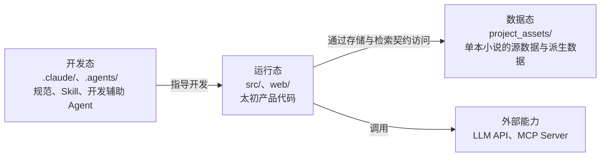
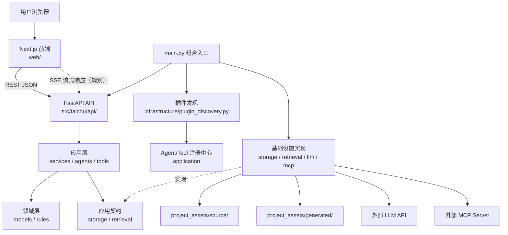
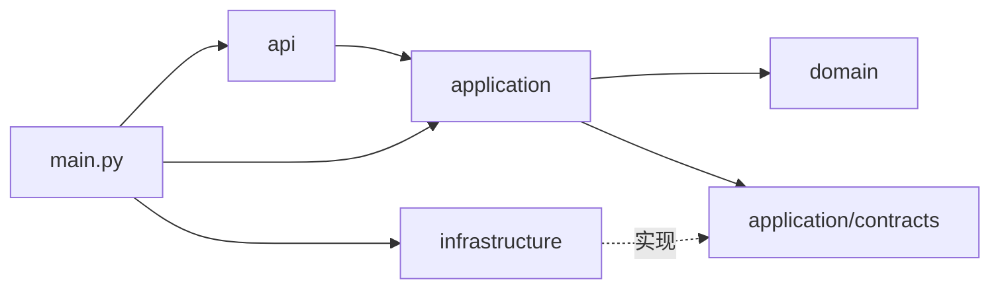

# 太初项目架构

> 更新日期：2026-06-25
>
> 状态：已落地的架构基线。新增功能必须按本文结构落位。

## 1. 架构目标

太初是面向单本玄幻小说的个人 AI 写作助手。架构设计优先保证：

- 系统运行期间只有一个小说上下文，不引入小说选择和跨小说歧义。
- 开发辅助能力、产品运行代码、小说数据互不混合。
- API、业务用例、小说领域规则、技术实现职责清晰。
- Agent、Tool、存储、检索、LLM 和 MCP 均有稳定扩展入口。
- 用户创作内容是唯一事实来源，索引和缓存可以完整重建。
- 新增 Agent 只需新增目录并实现协议，不修改已有注册逻辑。
- 不以“当前实现简单”或“以后再拆”为理由合并已经明确不同的职责。

## 2. 三种状态边界

项目按用途划分为开发态、运行态和数据态。这是项目边界，不是后端代码分层。



### 2.1 开发态

开发态内容只服务于开发者和编码助手，不参与太初产品运行。

```text
.claude/
├── agents/                         # Claude Code 开发辅助 Agent
│   ├── code-reviewer.md
│   ├── frontend-reviewer.md
│   └── langgraph-debugger.md
├── rules/                          # 强制开发规范
│   ├── FRONTEND_STANDARDS.md
│   ├── PYTHON_CODING_STANDARDS.md
│   ├── LANGGRAPH_DEV_GUIDE.md       # 规划
│   └── GIT_WORKFLOW.md              # 规划
├── skills/                         # Claude Code 可执行开发流程
├── management/                     # 持续更新的开发参考
│   └── PROJECT_ARCHITECTURE.md
├── changelog/                      # 变更记录
├── settings.json
└── settings.local.json             # 本地配置，不提交 Git

.agents/
└── skills/                         # Codex 使用的项目级 Skill
```

必须区分两个同名目录：

| 目录 | 使用者 | 用途 | 是否参与产品运行 |
|---|---|---|---|
| `.claude/agents/` | Claude Code | 代码审查、调试、测试等开发辅助 | 否 |
| `src/taichu/application/agents/` | 太初用户 | 续写、润色、审查等小说创作工作流 | 是 |

开发态 Agent 不得被 FastAPI 动态加载，产品运行时 Agent 也不得存放开发规范或开发提示词。

### 2.2 运行态

运行态由前端和后端组成：

- `web/`：Next.js 用户界面，只通过 API 使用后端能力。
- `src/taichu/`：FastAPI、应用用例、领域模型和基础设施实现。
- `tests/`：与运行代码对应的自动化测试。

### 2.3 数据态

数据态保存当前单本小说的全部创作资产。项目不引入多小说 `project_id` 隔离。

单本小说是不可变产品边界：

- 系统不提供小说列表、创建多本小说、切换小说或跨小说检索能力。
- API、Service、Agent、Tool 和存储契约不接收 `project_id`、`novel_id` 等小说选择参数。
- `project_assets/source/` 整体就是当前唯一小说的上下文根目录。
- 用户提到“主角”“反派”“世界观”“当前章节”等指代时，系统默认在当前唯一小说内解析。
- 人物、地点等实体仍使用稳定 ID 关联；单本小说只消除跨小说歧义，不取消小说内部实体主键。

```text
project_assets/
├── source/                          # 唯一事实来源，必须备份
│   ├── metadata.yaml               # 小说元信息、schema_version
│   ├── worldbuilding/
│   │   ├── cultivation_system.md
│   │   ├── geography.md
│   │   └── history.md
│   ├── characters/
│   ├── techniques/
│   ├── locations/
│   ├── factions/
│   ├── plots/
│   │   ├── arcs/
│   │   └── outlines/
│   ├── manuscripts/
│   │   └── chapters/
│   ├── timeline/
│   ├── inspirations/
│   └── templates/
│
└── generated/                       # 可删除、可完整重建
    ├── vector_store/
    │   └── chroma/
    ├── embedding_cache/
    ├── search_index/
    ├── exports/                     # 可再次导出的产物
    └── temp/
```

数据态遵循以下强制规则：

- `source/` 是唯一事实来源，向量库、搜索索引和缓存不能反向成为业务主数据。
- 所有检索范围默认是当前唯一小说，不设计跨小说过滤条件。
- 删除整个 `generated/` 后，系统必须能根据 `source/` 完整重建。
- Agent、API 路由和前端不得直接读写 `project_assets/`。
- 应用层通过 `StorageContract` 和 `RetrievalContract` 访问数据。
- 人物、地点、势力、功法和事件使用稳定 ID 关联，不以中文名或文件名作为主键。
- 源数据包含 `schema_version`，为未来数据迁移保留依据。

### 2.4 项目根目录总览

```text
Taichu/
├── .claude/                         # Claude Code 开发态配置
├── .agents/                         # Codex 项目级开发态配置
├── src/taichu/                      # 后端运行代码
├── web/                             # 前端运行代码
├── tests/                           # 后端自动化测试
├── project_assets/                  # 单本小说数据态资产
├── docs/                            # 有日期的阶段性技术说明
├── 产品文档/                         # 拆分后的产品设计资料
├── pyproject.toml                   # Python 项目与 uv 依赖
├── start.bat                        # Windows 一键启动入口
├── CLAUDE.md                        # Claude Code 项目约束
└── AGENTS.md                        # Codex 项目约束
```

## 3. 系统交互总览



### 3.1 前后端交互约束

1. 前端通过统一 API Client 请求 `http://localhost:8000`，组件内不得散落直接 `fetch`。
2. FastAPI 路由只负责协议转换、参数校验、权限边界和响应格式化，不编写业务逻辑。
3. 普通 CRUD 和跨实体流程调用 `application/services/`。
4. AI 工作流调用 `application/agents/`，Agent 可编排应用 Tool，但不直接操作文件、数据库或外部 MCP。
5. 流式生成统一使用可替换的传输协议；首选 SSE，具体实现不得泄漏到领域层。
6. API 请求和响应模型属于传输模型，放在 `api/schemas/`，不得与领域实体混用。
7. 前端不得直接访问 LLM、ChromaDB 或 `project_assets/`。

### 3.2 典型请求链路

普通知识库编辑：

```text
知识库页面
→ web/src/lib/api/
→ api/routes/knowledge.py
→ application/services/knowledge_service.py
→ application/contracts/storage.py
→ infrastructure/storage/
→ project_assets/source/
```

Agent 写作请求：

```text
写作页面
→ api/routes/agents.py
→ application/agents/registry.py
→ 对应 Agent 的 graph.py
→ application/tools/retrieval.py
→ application/contracts/retrieval.py
→ infrastructure/retrieval/
→ source/ + generated/search_index 或 vector_store
→ infrastructure/llm/
→ 返回生成结果
```

插件启动注册：

```text
main.py
→ infrastructure/plugin_discovery.py 扫描并动态导入
→ application/agents/registry.py 校验协议并注册
→ application/tools/registry.py 校验协议并注册
```

发现机制只负责“找到候选插件”，注册中心负责“校验、保存和查询”。二者不得合并。

## 4. 后端目标结构

```text
src/taichu/
├── __init__.py
├── main.py                            # 组合入口：创建实例、注入依赖、启动 FastAPI
├── config.py                          # 只读取和校验环境变量，不创建业务对象
│
├── api/                               # HTTP/流式传输层
│   ├── __init__.py
│   ├── deps.py                        # 从应用容器取得依赖
│   ├── router.py                      # 汇总路由
│   ├── schemas/                       # API 请求/响应模型
│   │   ├── agents.py
│   │   ├── knowledge.py
│   │   ├── outline.py
│   │   └── common.py
│   └── routes/
│       ├── agents.py                  # Agent 查询、调用、流式输出
│       ├── knowledge.py               # 知识库 CRUD
│       ├── outline.py                 # 大纲 CRUD
│       ├── manuscript.py              # 正文与章节
│       ├── settings.py                # 模型和用户设置
│       └── health.py                  # 健康检查
│
├── application/                       # 用例与能力编排层
│   ├── capabilities.py                # Agent/Tool 共用的能力注入上下文
│   ├── contracts/                     # 应用依赖的稳定接口
│   │   ├── storage.py                 # 源数据持久化接口
│   │   └── retrieval.py               # 关键词/语义/混合检索接口
│   │
│   ├── services/                      # 非 Agent 业务用例
│   │   ├── knowledge_service.py
│   │   ├── outline_service.py
│   │   ├── manuscript_service.py
│   │   ├── timeline_service.py
│   │   ├── import_service.py
│   │   ├── export_service.py
│   │   └── index_service.py           # 重建 generated/ 派生数据
│   │
│   ├── agents/                        # 产品运行时 Agent 插件
│   │   ├── contract.py                # AgentManifest、调用协议
│   │   ├── registry.py                # 协议校验、注册和查询
│   │   ├── chat/
│   │   ├── continuation/
│   │   ├── generation/
│   │   ├── polishing/
│   │   ├── rewriting/
│   │   ├── style_transfer/
│   │   ├── proofreading/
│   │   ├── pacing/
│   │   ├── outlining/
│   │   └── review/
│   │
│   └── tools/                         # Agent 可复用的原子能力
│       ├── contract.py                # Tool 协议
│       ├── registry.py                # Tool 校验、注册和查询
│       ├── retrieval.py
│       ├── consistency.py
│       ├── foreshadowing.py
│       ├── word_count.py
│       └── text_transform.py
│
├── domain/                            # 技术无关的小说领域
│   ├── models/
│   │   ├── character.py
│   │   ├── worldbuilding.py
│   │   ├── technique.py
│   │   ├── location.py
│   │   ├── faction.py
│   │   ├── timeline.py
│   │   ├── outline.py
│   │   ├── manuscript.py
│   │   └── inspiration.py
│   ├── rules/                         # 跨实体业务规则
│   │   ├── identity.py                # 稳定 ID 与关联规则
│   │   ├── outline.py                 # 卷/章/节结构约束
│   │   └── timeline.py                # 时间线排序和关联约束
│   └── exceptions.py                  # 领域异常
│
└── infrastructure/                    # 可替换技术实现
    ├── plugin_discovery.py             # 扫描和动态导入 Agent/Tool
    ├── storage/
    │   ├── json_backend.py
    │   ├── markdown_backend.py
    │   └── sqlite_backend.py           # 规划
    ├── retrieval/
    │   ├── keyword.py
    │   ├── vector.py
    │   └── hybrid.py
    ├── llm/
    │   ├── factory.py
    │   ├── providers/
    │   │   ├── deepseek.py
    │   │   ├── openai.py               # 规划
    │   │   └── anthropic.py            # 规划
    │   └── usage.py                    # Token 与费用统计
    ├── mcp/
    │   ├── client.py                   # 调用外部 MCP Server
    │   ├── capability_adapter.py       # MCP Tool 转为应用能力
    │   └── server.py                   # 对外暴露太初能力（规划）
    └── indexing/
        ├── embeddings.py
        └── vector_store.py
```

### 4.1 后端依赖方向



强制约束：

- `domain` 不依赖 `api`、`application`、`infrastructure`、LangGraph、LLM、MCP 或具体存储。
- `application` 不导入具体存储、ChromaDB 或具体 LLM Provider。
- `infrastructure` 不包含小说业务规则。
- `api` 不直接调用基础设施实现。
- `main.py` 是组合入口，负责创建基础设施实例并注入应用层。
- `config.py` 只提供经过校验的 settings，不创建 LLM、存储、检索器或注册中心。

### 4.2 Agent 协议

Agent 协议归属 `application/agents/contract.py`，不放入领域层。

协议至少声明：

```python
name = "continuation"
label = "章节续写"
description = "根据正文和相关设定续写章节"
required_capabilities = {"llm", "knowledge_search"}
exposures = {"api", "ui", "mcp"}
```

- `required_capabilities` 表示运行依赖，未来可增加 `web_search`、`image_generation`、`file_read` 等成员。
- `exposures` 表示允许暴露的渠道，未来可增加新的调用入口。
- 不为每项能力增加 `knowledge_required`、`frontend_visible` 等布尔字段。
- 输入和输出 Schema、流式调用方式由协议统一定义并由注册中心校验。

## 5. 前端目标结构

```text
web/
├── src/
│   ├── app/                            # Next.js App Router
│   │   ├── layout.tsx
│   │   ├── page.tsx                   # Bento Grid 首页
│   │   ├── chat/
│   │   ├── writing/
│   │   ├── outline/
│   │   ├── knowledge/
│   │   │   ├── characters/
│   │   │   ├── worldbuilding/
│   │   │   ├── techniques/
│   │   │   ├── locations/
│   │   │   └── timeline/
│   │   ├── inspirations/
│   │   ├── review/
│   │   ├── history/
│   │   └── settings/
│   │
│   ├── components/
│   │   ├── ui/                        # shadcn/ui 基础组件
│   │   ├── layout/                    # 返回按钮、页面框架
│   │   ├── chat/
│   │   ├── writing/
│   │   ├── outline/
│   │   ├── knowledge/
│   │   └── review/
│   │
│   ├── hooks/                         # 客户端交互状态
│   │   ├── use-chat.ts
│   │   ├── use-stream.ts
│   │   └── use-agents.ts
│   │
│   └── lib/
│       ├── api-client.ts              # 唯一 HTTP 请求入口
│       ├── api/                       # 按后端资源封装请求
│       │   ├── agents.ts
│       │   ├── knowledge.ts
│       │   ├── outline.ts
│       │   └── manuscript.ts
│       ├── types/                     # API 类型
│       └── utils.ts
│
├── public/
├── package.json
└── next.config.ts
```

新增通用 Agent 时，通用聊天或操作面板可根据 `/api/agents` 返回的 `exposures` 动态展示，不需要修改固定列表。若新增的是独立产品页面，仍应新增对应前端路由和交互界面，不能把“Agent 可自动注册”误解为“任何新功能都无需修改前端”。

## 6. 测试结构

```text
tests/
├── unit/
│   ├── application/
│   │   ├── services/
│   │   ├── agents/
│   │   └── tools/
│   ├── domain/
│   └── infrastructure/
├── integration/
│   ├── api/
│   ├── storage/
│   ├── retrieval/
│   └── mcp/
└── fixtures/
    └── project_assets/                # 隔离的测试小说数据
```

测试不得直接使用真实 `project_assets/`，避免污染用户小说数据。

## 7. 未来功能落点

| 新增或变更内容 | 主要目录 | 配套位置 |
|---|---|---|
| 新增小说创作 Agent | `application/agents/{agent_name}/` | 实现 Agent 协议；如需独立页面则增加前端路由 |
| 修改 Agent 公共协议 | `application/agents/contract.py` | 同步注册校验与 API Schema |
| Agent 自动发现 | `infrastructure/plugin_discovery.py` | 不修改注册中心职责 |
| 新增可复用 Tool | `application/tools/{tool_name}.py` | 在 Tool 协议中声明能力 |
| 新增普通业务流程 | `application/services/` | API 路由只调用 Service |
| 新增领域实体 | `domain/models/` | 增加 Service、API Schema 和 source 目录映射 |
| 新增跨实体业务规则 | `domain/rules/` | 由 Service 或 Agent 调用 |
| 新增 API 端点 | `api/routes/` | 请求响应模型放 `api/schemas/` |
| 新增前端功能页 | `web/src/app/{feature}/` | 组件放 `components/{feature}/` |
| 新增前端 API 调用 | `web/src/lib/api/` | 类型放 `web/src/lib/types/` |
| 新增存储后端 | `infrastructure/storage/` | 实现 `application/contracts/storage.py` |
| 新增检索策略 | `infrastructure/retrieval/` | 实现 `application/contracts/retrieval.py` |
| 更换向量数据库 | `infrastructure/indexing/` | 只重建 `project_assets/generated/` |
| 新增 LLM 提供商 | `infrastructure/llm/providers/` | 更新配置与工厂，不修改 Agent |
| Token/费用统计 | `infrastructure/llm/usage.py` | 展示用例放 Service，页面放 `web/src/app/settings/` |
| 调用外部 MCP | `infrastructure/mcp/client.py` | 通过 capability adapter 注入 Agent/Tool |
| 对外暴露 MCP 能力 | `infrastructure/mcp/server.py` | 只暴露 `exposures` 包含 `mcp` 的能力 |
| 新增源数据类型 | `project_assets/source/` | 同步领域模型和存储映射 |
| 新增索引或缓存 | `project_assets/generated/` | 必须提供重建流程 |
| 导入/导出 | `application/services/import_service.py`、`export_service.py` | 格式适配器放 infrastructure |
| 开发辅助 Agent | `.claude/agents/` | 不得放入产品运行代码 |
| 新增强制编码规则 | `.claude/rules/` | 与 `CLAUDE.md` 不可变决策保持一致 |
| 新增重复开发流程 | `.claude/skills/` 或 `.agents/skills/` | 按对应 Skill 规范创建 |

### 7.1 产品功能映射

| 产品能力 | 后端主要落点 | 前端主要落点 |
|---|---|---|
| A 内容生成 | `application/agents/chat|continuation|generation/` | `app/chat/`、`app/writing/` |
| B 内容优化 | `application/agents/polishing|rewriting|style_transfer|proofreading|pacing/` | 写作页上下文操作区 |
| C 结构与规划 | `services/outline_service.py`、`agents/outlining/` | `app/outline/` |
| D 知识库 | `services/knowledge_service.py`、`domain/models/` | `app/knowledge/` |
| E 一致性与审查 | `application/tools/consistency.py`、`agents/review/` | `app/review/` |
| F 历史与版本 | `services/manuscript_service.py` 与未来版本存储实现 | `app/history/` |
| G 模板与工作流 | `application/services/`、`application/agents/` | `app/settings/` 或独立工作流页 |
| H 导入导出 | `import_service.py`、`export_service.py` | 各资源页的导入导出入口 |
| I 系统与配置 | `config.py`、`infrastructure/llm/`、用量 Service | `app/settings/` |
| DX-1 角色形象 | `domain/models/character.py` 与媒体基础设施 | `app/knowledge/characters/` |
| DX-2 地点 3D 场景 | `domain/models/location.py` 与媒体/场景基础设施 | `app/knowledge/locations/` |

## 8. 已完成迁移

后端结构已于 2026-06-25 一次性迁移，未保留旧目录兼容层：

| 当前路径 | 目标路径 |
|---|---|
| `src/taichu/agents/base.py` | `src/taichu/application/agents/contract.py` |
| `src/taichu/agents/chat/` | `src/taichu/application/agents/chat/` |
| `src/taichu/core/registry.py` 的注册部分 | `src/taichu/application/agents/registry.py` |
| `src/taichu/core/registry.py` 的扫描导入部分 | `src/taichu/infrastructure/plugin_discovery.py` |
| `src/taichu/core/storage.py` 的抽象接口 | `src/taichu/application/contracts/storage.py` |
| `src/taichu/core/storage.py` 的 JSON 实现 | `src/taichu/infrastructure/storage/json_backend.py` |
| `src/taichu/core/llm.py` | `src/taichu/infrastructure/llm/` |
| `src/taichu/models/schemas.py` | `src/taichu/api/schemas/agents.py` |
| 空的 `data/` | `project_assets/source/` 与 `project_assets/generated/` |

迁移已同步处理依赖导入、配置、测试、数据目录、产品架构文档和旧目录清理。后续不得重新引入 `src/taichu/core/`、顶层 `agents/` 或顶层 `models/`。

## 9. 架构检查清单

新增功能前检查：

- 功能属于开发态、运行态还是数据态？
- 这是 HTTP 传输、应用用例、领域规则，还是技术实现？
- 是否通过契约隔离了存储、检索、LLM 或 MCP？
- 是否把源数据和可重建数据分开？
- 是否使用稳定 ID 关联领域实体？
- 新 Agent 是否只新增目录并实现协议？
- 插件发现和注册校验是否仍保持分离？
- 是否需要独立前端页面，还是可以使用通用 Agent 界面？
- 是否为新增能力添加了对应单元测试或集成测试？
- 技术替换后是否清理了旧依赖、配置、目录和文档？
