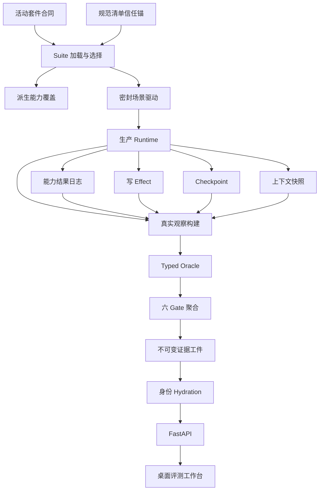
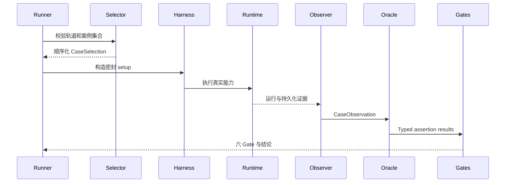
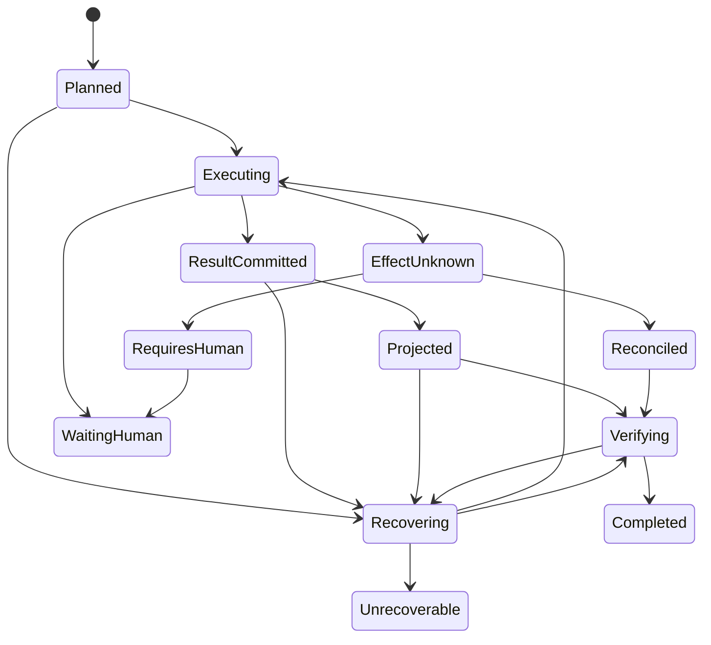

# 通用写作智能体 37 类 Benchmark 落实技术设计

## 1. 概述

本设计把 37 条已校验能力合同落入太初现有固定评测体系，并以可复核的 Runtime 行为、产物、资源后态、恢复记录和上下文证据替代“脚本走完、调用成功、状态完成”的弱代理。`suite.json` 是活动执行目录与完整逐案例合同的唯一来源；`suite_loader.py` 同时保留一个不参与业务执行的最小 `ApprovedSuiteContract` 先验信任锚，只钉住规范 37 条的精确 ID、中文名、顺序与轨道。合成与真实模型轨道共享一套 typed oracle 和六 Gate 判定，合成运行全部 37 条，真实模型运行只允许第 1—21 条。

设计复用当前真实 Tool/Subagent、动态 DAG、Strict Scripted Driver、Gate 聚合器、Effect、LangGraph Checkpoint、Context Snapshot、不可变工件和评测工作台。生产 Runtime 只修复由恢复/上下文 RED 案例证明的通用缺口，不出现 Benchmark case-ID 分支、任务专用能力或固定生产 DAG。

## 2. 目标

- 精确、可执行且可验证地落实 37 条活动 Benchmark 与 `S37/L21`。
- 让 suite 自哈希完整性与独立批准锚形成两道加载门禁，重算被篡改 suite 的自哈希也不能绕过规范清单校验。
- 每案用 typed 行为合同、独立真实观察和六类非空证据形成 `PASSED/FAILED/INVALID`。
- 为八类恢复建立故障点、状态机、幂等/副作用/Checkpoint 生产契约。
- 为八类上下文压力建立密封构造、压缩前后证据、受保护事实和结果等价判定。
- 冻结新 37 基线且保持旧 23 工件、身份、数量和结论不可变。
- 让 API 和桌面网页按套件/运行自身事实显示动态计数和中文名称。

成功标准：活动合成完整套件仅在 37 案各自六 Gate 全部通过时形成新准入基线；Live 只包含 21 个适用案例；旧 23 可只读查询且不能与新身份混合。

## 3. 非目标

- 不选择或实现新的 RAG、向量、图检索、模型排行或长期流量评测。
- 不新建 Benchmark 专用 Tool/Subagent，不改变生产能力边界。
- 不要求外部 provider 在验收时可用，也不让 provider 受阻覆盖合成准入。
- 不把运行工作记忆称为长期记忆，不向长期记忆层填入小说知识或 Runtime 工作状态。
- 不原地改写旧 23 运行、基线或 `docs/历史/`。
- 不重构评测页面路由、导航、布局、主题、动效或移动端。

## 4. 边界承诺

### 4.1 本规格负责

- 活动 `suite.json` 的 37 条清单、顺序、中文名称、轨道、scenario/setup、终态、断言和证据合同。
- Suite 选择校验、能力覆盖派生、真实观察、可枚举 oracle、证据完整性和六 Gate 条件。
- Synthetic/Live 共享判定、密封夹具、故障/压力计划和逐案资源安全。
- 普通能力结果持久化、Checkpoint 完整性门禁、恢复决定和上下文装配轨迹等通用 Runtime 契约。
- 新 37 基线身份、旧 23 历史索引、跨身份 Hydration 拒绝。
- Benchmark API/前端动态数量、运行自身统计和中文案例描述。

### 4.2 边界之外

- 检索算法、索引、数据库和供应商的具体选型。
- Subagent 内部逐 token/逐节点 Checkpoint；当前只定义父 Runtime 的完整结果边界。
- 真实模型效果排名、定价比较和 provider 可用性修复。
- 历史工件内容迁移、业务正文/结构/知识迁移。
- Benchmark 页面视觉、导航、桌面以外适配。
- 覆盖 CapabilityResult、Effect、Checkpoint、Context、Replay、Event、Memory 的全局 crash-resumable 删除产品、永久删除审计与应用启动恢复；本规格只把 CapabilityResult 接入既有 conversation/run 生命周期清理，并证明 Benchmark case workspace 密封销毁。
- 当前工作树若已存在全局删除扩展，它仍属于本规格之外的未独立授权实现；本设计、任务拆分与验收不得用其内部协议、跨仓储状态机或启动恢复来证明本规格通过。

### 4.3 允许的依赖

- 评测应用层可依赖当前 Pydantic strict model、生产能力 manifest、Runtime 只读证据 Protocol 和 Gate 聚合器。
- Harness 可依赖真实 Runtime factory、密封 Markdown/MongoDB/JSON 副本、Strict Scripted Driver、故障注入器和上下文快照。
- 生产 Runtime 可依赖应用层 Repository Protocol；基础设施层实现 JSON durable store、LangGraph checkpointer 和现有 Effect store。
- CapabilityResult 清理只依赖既有 `GeneralAgentRunService.delete_conversation(conversation_id)` / `delete(run_id)` 生命周期入口、明确的 `CapabilityResultOwner(conversation_id, run_id)` 和 Repository `delete_run(owner)`；Harness 继续依赖现有 `FixtureIsolationController` 的受信工作区所有权与物理清理边界。
- API 依赖评测应用服务；前端只依赖 FastAPI DTO，不直接读取 `suite.json` 或工件目录。
- 依赖方向固定为：`typed contracts → suite/selection → Runtime evidence ports → oracle/Gate → immutable artifacts → API → UI`。Harness 适配位于基础设施层；领域层不依赖评测、Agent、LangGraph 或 JSON 仓储。

### 4.4 重新验证触发器

- 任一 case ID、顺序、中文名、轨道、输入、assertion、evidence、fault/pressure plan 或 fixture 变化。
- `ApprovedSuiteContract` 的任一 ID、中文名、顺序或轨道变化；该变更必须与已校验需求同步重新验证，不能由修改 suite 自哈希替代。
- Tool/Subagent manifest、handler identity、授权、side-effect 分类或输出 schema 变化。
- CapabilityResult/Effect 的身份、原子写入、幂等、对账或复用规则变化。
- LangGraph 版本、Checkpoint format/thread/revision/hash 或恢复入口变化。
- 五层名称、裁剪优先级、current request、工作记忆 validity、digest/fallback 或节点投影变化。
- Suite/baseline/history manifest、Hydration join 或 API DTO 变化。
- 前端路由、信息架构、主题或组件依赖变化。

## 5. 架构

### 5.1 当前架构对齐

- `suite_loader.py` 已按“suite 自哈希 → `_EXPECTED_CASES`/轨道先验 → capability catalog/fixture”校验；保留该最小先验并统一命名语义为 `ApprovedSuiteContract`，但不让它成为 runner、API 或 UI 的第二目录。
- `runtime_factory.py` 已在密封环境组合真实能力，继续作为被测对象。
- `strict_driver.py` 继续验证确定性协议；不输出最终正确性结论。
- `gates.py` 已支持六 Gate 与 `INVALID`，只替换上游条件。
- Effect、Checkpoint、Context Snapshot 和不可变 artifact repository 原位扩展。

### 5.2 结构与依赖



关键边界：Suite 声明“要验证什么”并作为唯一活动执行目录；ApprovedSuiteContract 只回答“是否仍是批准的规范 37 条”；Harness 声明“如何密封构造与中断”；Runtime 产生真实行为；Oracle 只消费 observation；Gate 聚合不读取脚本 response；UI 不重新计算业务真值。

### 5.3 技术栈

| 层级 | 选择 | 角色 | 新依赖 |
|---|---|---|---|
| 后端 | Python 3.12+、Pydantic 2、FastAPI | strict tagged union、服务/API | 无 |
| Runtime | 当前 LangGraph/checkpointer | 动态 DAG 与步骤恢复 | 无 |
| 业务事实 | Markdown、MongoDB | 仅密封副本参与评测 | 无 |
| 评测工件 | 当前 JSON 内容寻址仓储 | 运行、审计、回放与索引 | 无 |
| 前端 | Next.js 16、React 19、TypeScript、Tailwind、本地组件 | 中文桌面工作台 | 无 |

## 6. 文件结构规划

### 6.1 新增文件

```text
src/taichu/application/evaluations/general_agent_benchmark/
├── observations.py          # CaseObservation 与证据身份
├── claim_catalog.py         # ClaimCatalog 严格加载、引用校验与身份计算
├── oracles.py               # ClaimNormalizerRegistry、assertion/probe 与 Gate 条件构建
└── selection.py             # suite/track/case 选择及 S37 L21 门禁
src/taichu/application/contracts/
└── general_agent_capability_results.py  # durable 能力结果 owner 与 Repository Protocol
src/taichu/infrastructure/general_agent_runs/
└── capability_result_repository.py      # per-result record/index create-once 实现
src/taichu/infrastructure/evaluations/general_agent_benchmark/
└── fault_pressure.py        # typed 故障序列与压力夹具适配
tests/fixtures/evaluations/general_writing_agent_benchmark/fixtures/core_novel/
├── recovery/                # 八类恢复输入和 fault plan
└── context_pressure/        # 八类压力数据、sentinel 与成对输入
tests/fixtures/evaluations/general_writing_agent_benchmark/
└── claim-catalog.json       # 与 scripted response 分离的预期 claim 权威目录
tests/unit/application/evaluations/general_agent_benchmark/
├── test_claim_oracles.py    # 直接回答、证据消费、修订正反例
└── test_artifact_identity.py # 三类关系的身份正反例
tests/unit/application/general_agent/
└── test_capability_result_recovery.py # 提交窄窗、恢复顺序和父生命周期清理
tests/unit/infrastructure/general_agent_runs/
└── test_capability_result_repository.py # owner 寻址、并发索引、冲突、损坏与路径安全
```

### 6.2 修改文件

| 文件组 | 变更责任 |
|---|---|
| `tests/fixtures/.../suite.json` | 切换 `suite@2`，精确 37 条 typed 合同 |
| `tests/fixtures/.../fixture-manifest.json` 及 fixture 文件 | 纳入新增场景、故障、压力、预期后态与 hash |
| `suite_loader.py`、`models.py` | 合并唯一 suite model，保留/收敛 `_EXPECTED_CASES` 为最小 ApprovedSuiteContract，新增 union、终态、assertion、evidence、fault/pressure 类型 |
| `capability_catalog.py` | 删除案例/轨道/调用双份常量；从 suite + 生产 manifest 派生覆盖 |
| `synthetic_suite.py`、`live_runtime.py` | 共享 selection、observation、oracle/Gate；Live 只运行 21 |
| `synthetic_environment.py`、`synthetic_runtime.py`、`runtime_factory.py` | 密封 setup、fault/pressure 注入、真实快照和 Runtime 依赖装配 |
| `gates.py`、`evidence_builder.py`、`run_models.py` | 非空 evidence、完整性、typed assertion 结果和真实计数 |
| `general_agent/recovery.py`、`models.py`、`executor.py`、`service.py` | CapabilityResult、恢复决定、完整性门禁、上下文安全终态 |
| `general_agent/context.py`、`context_snapshot_repository.py` | assembly trace、必需路径、pre/post stats、受保护/遗漏 refs |
| `artifact_repository.py`、`synthetic_baseline.py`、`artifact_hydration.py` | baseline manifest catalog、旧 23 索引、身份 join |
| `src/taichu/application/evaluations/general_agent_benchmark/experiments.py` | 用三层身份替换隐式全字段相等，保留“冻结字段 + 声明差异”比较模式 |
| 三个冻结脚本 | 从 suite/结果推导 37/37 或 21/21，移除 23 常量 |
| `services.py`、`container.py`、API schema/route | suite detail、selection validation、动态 summary |
| `src/taichu/main.py` | 在唯一生产组合根构造 CapabilityResult 仓储并注入 Runtime 与恢复服务 |
| `src/taichu/application/general_agent/service.py` | 在既有 conversation/run 删除入口中按父 run 构造 owner 并调用 CapabilityResult `delete_run(owner)`；不重构其他仓储删除 |
| `src/taichu/infrastructure/evaluations/general_agent_benchmark/fixture_manager.py`、`synthetic_environment.py` | 复用 `FixtureIsolationController` 与既有 Runtime 清理入口，形成 case workspace 密封销毁和作者/其他案例哨兵证明 |
| `tests/unit/infrastructure/evaluations/general_agent_benchmark/test_workspace_cleanup.py` | 覆盖 owner、清理失败保留现场、路径所有权、Mongo/工作区销毁与隔离哨兵 |
| `project_assets/readme.md` | 只登记 CapabilityResult 的运行/审计职责、父生命周期及非业务事实边界 |
| `web/src/lib/types/general-agent-benchmark.ts` | Suite detail/case description 与真实计数类型 |
| `web/src/lib/api/general-agent-benchmark.ts` | 调用现有 suite detail 端点 |
| `web/src/lib/general-agent-benchmark-view.ts`、`...display.ts` | 真实 conclusion 聚合、活动中文目录、历史 fallback |
| `general-agent-evaluation-shell.tsx` | 移除 23 回退/结论/范围文案并消费 view model |

评审修复涉及的新边界使用以下完整物理归属；后续任务不得把它们移到 Harness 私有模块或再建平行来源：

| 组件/数据 | 状态 | 完整路径 |
|---|---|---|
| ApprovedSuiteContract 最小先验锚 | 修改现有；保留 `_EXPECTED_CASES` 所代表的职责，可在同文件内收敛命名 | `src/taichu/application/evaluations/general_agent_benchmark/suite_loader.py` |
| ClaimCatalog 模型与加载 | 计划新增 | `src/taichu/application/evaluations/general_agent_benchmark/claim_catalog.py` |
| ClaimCatalog 权威数据 | 计划新增 | `tests/fixtures/evaluations/general_writing_agent_benchmark/claim-catalog.json` |
| ClaimNormalizerRegistry / Typed Oracle | 计划新增 | `src/taichu/application/evaluations/general_agent_benchmark/oracles.py` |
| CapabilityResultOwner 与 Repository Protocol | 计划新增 | `src/taichu/application/contracts/general_agent_capability_results.py` |
| owner-aware CapabilityResult JSON 实现与 per-result 权威索引 | 计划新增 | `src/taichu/infrastructure/general_agent_runs/capability_result_repository.py` |
| CapabilityResult 生产组合根 | 修改现有 | `src/taichu/main.py` |
| CapabilityResult 数据目录说明 | 修改现有 | `project_assets/readme.md` |
| CapabilityResult lifecycle 接线 | 修改现有 | `src/taichu/application/general_agent/service.py` |
| Benchmark workspace 受信清理与隔离证明 | 修改现有 | `src/taichu/infrastructure/evaluations/general_agent_benchmark/fixture_manager.py`、`src/taichu/infrastructure/evaluations/general_agent_benchmark/synthetic_environment.py` |
| ArtifactIdentity / ComparabilityKey / DeclaredDifferences | 修改现有 | `src/taichu/application/evaluations/general_agent_benchmark/models.py` |
| relation-specific 比较校验 | 修改现有 | `src/taichu/application/evaluations/general_agent_benchmark/experiments.py` |
| BenchmarkIdentityJoiner 与历史只读 Hydration | 修改现有 | `src/taichu/infrastructure/evaluations/general_agent_benchmark/artifact_hydration.py` |

### 6.3 删除与替换

- 删除活动 `_CASE_IDS`、`CORE_CASES`、`CORE_INVOCATION_EXPECTATIONS`；保留生产能力集合。
- 不删除 loader 的规范批准锚；将当前 `_EXPECTED_CASES` 与独立轨道切片校验收敛为只供加载先验使用的 ApprovedSuiteContract，禁止 runner/API/UI/capability catalog 消费。
- 删除未被正式 runner 使用的重复 `CaseSpec/SuiteSpec` 或 `Authored*` 中被替代的一套。
- 从 suite 删除 `external_access_denied`、`runtime_checkpoint_recovery`；第 27 条承接旧校验中断语义。
- 删除 `security_ok=True`、`bool(interaction_records)`、空 `evidence_refs`、统一 `completed` 和默认机制通过路径。
- 删除 runner/environment 中被 typed oracle 替代的 case-ID 判定。
- 删除活动 API、冻结、前端和测试中的 `23`/`23/23`；保留历史中文 fallback 和旧 immutable artifacts。

## 7. 核心数据与接口契约

### 7.1 Suite 合同

`AuthoredSuiteSpec` 升级为机器兼容格式 `taichu.general_agent_benchmark.suite@2`；`extra="forbid"`。

```text
AuthoredCaseSpec
  case_id: StableId
  name: 中文非空
  summary: 中文一句话说明
  applicable_tracks: 非空 TrackKind 集合
  user_request / user_request_raw: 字节内容一致
  scenario: ScenarioSpec
  setup: SetupSpec
  expected_terminal: ExpectedTerminalSpec
  behavior_assertions: 非空 AssertionSpec 判别 union
  required_evidence: 每个 Gate 至少一项 EvidenceRequirementSpec
  required_invocations: 调用数量与拓扑合同
  scripted_steps: Strict Driver 协议
  budgets: 六类资源限制
```

`ScenarioSpec/SetupSpec` 只引用 fixture ID、资源快照 ID、memory seed、human decision、fault plan 和 pressure plan；不携带代码或 shell。`ExpectedTerminalSpec` 明确 `run_status`、`resumable`、`pending_human_kind`、`recovery_action` 和枚举 `reason_code`。

#### ApprovedSuiteContract 独立信任锚

`suite_loader.py` 保留当前 `_EXPECTED_CASES` 所代表的最小批准合同；实现可以在同一文件内继续使用该符号，或将其收敛命名为 `_APPROVED_SUITE_CONTRACT`，本设计不新增独立 manifest/文件，也不把计划命名冒充成已实现符号。每个批准项只含 `ordinal + case_id + 中文 name + canonical applicable_tracks`：

| # | case_id | 中文名 | 轨道 |
|---:|---|---|---|
| 1 | `direct_answer_current_request` | 当前请求直接回答 | S+L |
| 2 | `single_manuscript_search` | 单次正文检索 | S+L |
| 3 | `structure_coverage_read` | 结构与覆盖读取 | S+L |
| 4 | `single_knowledge_retrieval` | 单次知识检索 | S+L |
| 5 | `knowledge_catalog_identity_read` | 知识目录身份读取 | S+L |
| 6 | `external_research_grounded` | 外部资料有据研究 | S+L |
| 7 | `single_canon_evidence` | 单次设定证据 | S+L |
| 8 | `summary_world_character` | 摘要驱动世界与人物分析 | S+L |
| 9 | `architecture_scene_draft` | 架构场景与草稿流水线 | S+L |
| 10 | `parallel_review_triad` | 三类独立审查 | S+L |
| 11 | `revision_from_reviews` | 依据审查修订 | S+L |
| 12 | `manuscript_preview_only` | 正文补丁仅预览 | S+L |
| 13 | `manuscript_patch_authorized_resume` | 授权后应用确认预览 | S+L |
| 14 | `structure_create_update` | 结构创建并精确更新 | S+L |
| 15 | `structure_delete_second_confirmation` | 结构删除二次确认 | S+L |
| 16 | `knowledge_create_update` | 知识创建并精确更新 | S+L |
| 17 | `write_authorization_denied` | 写授权拒绝 | S+L |
| 18 | `memory_active_projection` | 有效运行工作记忆生效 | S+L |
| 19 | `memory_stale_dependency` | 过期记忆依赖排除 | S+L |
| 20 | `memory_rejected_parallel_isolation` | 被拒绝记忆分支隔离 | S+L |
| 21 | `memory_superseded_repair` | 被替代记忆修复 | S+L |
| 22 | `recovery_after_plan_before_execution` | 规划后执行前恢复 | S |
| 23 | `recovery_tool_result_before_consumption` | Tool 结果未消费前恢复 | S |
| 24 | `recovery_subagent_interrupted` | Subagent 中断恢复 | S |
| 25 | `recovery_waiting_authorization` | 授权等待中恢复 | S |
| 26 | `recovery_after_write_before_effect_success` | 写入后效果确认前恢复 | S |
| 27 | `recovery_verification_interruption` | 校验阶段中断恢复 | S |
| 28 | `recovery_multiple_interruptions` | 多次中断恢复 | S |
| 29 | `recovery_checkpoint_integrity_or_version` | Checkpoint 完整性与版本恢复 | S |
| 30 | `context_long_history_fact_retention` | 长历史关键事实保持 | S |
| 31 | `context_long_working_memory_priority` | 长工作记忆优先裁剪 | S |
| 32 | `context_large_node_output_projection` | 大节点输出投影 | S |
| 33 | `context_multi_source_overflow` | 多来源上下文共同超限 | S |
| 34 | `context_compression_result_equivalence` | 压缩前后结果等价 | S |
| 35 | `context_invalid_memory_pressure_isolation` | 无效记忆压力隔离 | S |
| 36 | `context_long_current_request_preserved` | 长当前请求完整保留 | S |
| 37 | `context_unsafe_compression_refusal` | 无法安全压缩时拒绝 | S |

`S+L` 的 canonical 轨道集合精确为 `synthetic + live_provider`，`S` 精确为 `synthetic`。该锚只在 `load_authored_suite` 的先验验证中读取；Selector、runner、capability catalog、API、UI 和 Oracle 只能消费验证成功后返回的 `AuthoredSuiteSpec`，禁止从批准锚派生第二套活动目录、调用计划或业务逻辑。Scenario/setup/terminal/assertion/evidence 等完整执行合同仍只在 `suite.json`；它们由 strict schema、引用校验和 suite content hash 形成内容身份，变化必须产生新 execution identity、重新执行完整准入，不能继承旧基线。

加载顺序与失败语义：

1. 解析 UTF-8 JSON，并确认根节点与 strict schema 可进入验证流程。
2. 先从除 `content_hash` 外的 canonical suite payload 重算自哈希；不一致返回 `suite_content_hash_mismatch`。
3. 自哈希通过后，在 typed model 验证内把每一项的 `ordinal/case_id/name/applicable_tracks` 与上表逐项比较。任何数量、ID、中文名、顺序或轨道差异返回 `suite_approved_contract_mismatch`。
4. 再校验 banned ID、RAG 占坑范围、scenario/setup/assertion/evidence、capability catalog hash、fixture manifest/snapshot 与全部引用。
5. 所有门禁通过后才返回 suite；此前不得创建 run/case workspace、调用 provider、写运行状态或执行任何案例。

因此，把任一 ID、中文名、顺序或轨道替换后同步重算 suite 自身 `content_hash`，仍会在第 3 步因不匹配独立信任锚而于执行前失败。负例必须逐类覆盖这四种替换，并断言 workspace/provider/case invocation 均为零。

其他加载不变量：

1. case order 与 cases 完全一致且唯一，数量恰为 37。
2. synthetic 适用集恰为 37；live_provider 恰为顺序中的前 21。
3. 旧两个 ID 不存在；scenario/setup/assertion/evidence 引用均可解析。
4. `required_evidence` 覆盖且只覆盖六个 GateKind。
5. suite content hash 只计算 suite 内容；fixture、catalog、oracle rule set 由 execution identity 连接。

### 7.2 轨道选择

```text
SuiteSelectionValidator.validate(
  suite,
  track,
  requested_case_ids
) -> CaseSelection | SelectionError
```

- 拒绝未知、重复、乱序和不适用 ID，并返回中文 ID 清单。
- `full_selection(synthetic)` 产生 37；`full_selection(live_provider)` 产生 21。
- API、Synthetic runner、Live runner、冻结器共同调用；验证通过前不得创建 case workspace 或调用 provider。
- partial run 可保存结果，但永远不满足完整 synthetic admission。

### 7.3 能力覆盖派生

```text
derive_capability_catalog(
  suite,
  production_capability_snapshot
) -> DerivedCapabilityCatalog
```

- 从 suite `required_invocations` 按 case order 聚合每个 Tool/Subagent 的覆盖 case；第一项仅作为稳定 primary display，不是第二份权威映射。
- 与 runtime factory 发现的真实 kind、name、handler identity、input/output schema hash 校验。
- 未知能力、kind 冲突、缺 handler 或生产 core capability 无覆盖时 suite 无效。
- catalog hash 来自派生结果，进入 execution identity；suite 不手写重复 case/track/invocation 常量。

### 7.4 Claim Oracle 与可枚举 assertion

#### 权威物理来源

- `tests/fixtures/evaluations/general_writing_agent_benchmark/claim-catalog.json` 是活动 Benchmark 预期 claim 的唯一物理来源；`suite.json` 只引用 `claim_id`、normalizer ID 和断言关系，不复制 claim 真值。
- `claim-catalog.json` 纳入 `fixture-manifest.json`，使用 `taichu.general_agent_benchmark.claim_catalog@1` 机器兼容 schema，`extra="forbid"`。每项包含 `claim_id`、typed `subject/predicate/object/polarity`、允许的规范词形、来源 fixture refs、允许的 normalizer ID/version；不得包含 scripted response 或从其生成。
- 计划新增的 `claim_catalog.py` 只负责严格加载、交叉引用和 canonical hash；计划新增的 `oracles.py` 是 `ClaimNormalizerRegistry` 的唯一代码注册点。Registry 是静态 `NormalizerKind → NormalizerDescriptor + pure function` 映射，不扫描模块、不动态 import。
- `OracleRuleSetIdentity` 保存 `catalog_schema/version/hash`、按 ID 排序的 registry descriptor hash、normalizer implementation code snapshot hash 和最终 `oracle_rule_set_sha256`。任一规则、别名、描述符或实现变化都产生新规则身份并触发新 execution identity。

纯函数合同：

```text
ClaimNormalizer.normalize(
  input: ClaimNormalizationInput
) -> ClaimProjection

ClaimNormalizationInput
  observed_text: 原始 final/artifact 字段
  observed_source_projection: 只含实际调用产出的 typed claims、source refs 与 content hashes
  normalizer_id/version: suite 声明且 Registry 已注册

ClaimProjection
  status: VALID | UNKNOWN | AMBIGUOUS
  observed_claims: 有序 ObservedClaim
  unmatched_spans / ambiguity_candidates
  input_sha256 / source_projection_sha256
  registry_descriptor_sha256 / normalization_trace
```

纯函数只执行 Unicode NFC、固定空白/标点规范化、ClaimCatalog 声明的有限别名替换、typed 主谓宾/极性投影、来源 span 绑定和结构化 diff；不接收 case expected claims、scripted steps/response、模型评分或可执行表达式，不访问网络/文件/数据库。Live 与 Synthetic 使用同一流程：

1. Observer 从实际展示文本、实际 capability output/resource diff 生成只读输入及 hash。
2. Registry 按 suite 声明的固定 normalizer ID/version 规范化；未注册版本立即 `INVALID`。
3. `VALID` projection 再与 ClaimCatalog 的 expected/forbidden claim IDs 比较；明确缺失或矛盾为 `FAILED`。
4. 无法解析的关键 span 为 `UNKNOWN`，同一 span 可映射多个互斥 claim 为 `AMBIGUOUS`；二者都使 Verifier 与依赖它的 Evidence Gate `INVALID`，不得按缺失 claim 降为普通失败或调用 LLM judge。
5. scripted response 在 Synthetic 中只能作为实际模型输出进入 Observer；Oracle 的 expected truth 和 normalizer 配置从独立 ClaimCatalog/Registry 读取。更改脚本而保持实际 observation 不变时 projection/hash 必须不变。

端到端合同例：

| 场景 | 实际 observation | deterministic projection 与数据流 | 结论 |
|---|---|---|---|
| 直接回答正例 | final 为“本轮直接回答，不调用工具或子智能体”，实际调用为空 | `route.direct`、`capability.none`；final span + invocation snapshot | expected claims 命中且零调用，Verifier `PASSED` |
| 直接回答负例 | final 声称先检索，或 invocation snapshot 出现 Tool | 投影为 `route.search` 或拓扑与 `capability.none` 冲突 | 明确矛盾，`FAILED`；“可能直接回答也可能检索”映射互斥 claims，`INVALID` |
| 证据消费正例 | Tool 实际返回 fixture claim `setting.lighthouse.flame.blue`，final 明确使用“蓝色火焰”并绑定同 source ref | final span → observed claim → Tool output content hash → fixture source ref | claim 与 dataflow 同时成立，`PASSED` |
| 证据消费负例 | scripted response 预写“蓝色”，实际 final 为“红色”或 final 无对应 source 绑定 | 投影为 forbidden claim 或 claim 无 dataflow | 前者 `FAILED`，后者证据 `INVALID`；脚本正确不能覆盖实际输出 |
| 修订正例 | review 指出受伤左臂不应挥剑；artifact diff 改为右手且 protected 段落 hash 不变 | `revision.target_fixed` + `protected.content_preserved`，均绑定 review/original/revised hashes | Claim、diff、后态共同 `PASSED` |
| 修订负例 | final 声称已修复但 artifact 未变，或同时改坏 protected 段落 | 文本 claim 与 resource diff 冲突，或 forbidden diff 命中 | `FAILED`；一个 diff 可解释为多个互斥修订目标时 `INVALID` |

`AssertionSpec` 是以下固定 kind 的判别 union：

- `call_count`、`call_topology`、`dataflow_identity`
- `final_claims`、`artifact_contract`、`resource_diff`
- `authorization_effect`、`memory_carrier_absence`
- `recovery_reuse`、`checkpoint_integrity`
- `context_preservation`、`result_contract_equivalence`
- `zero_capability_or_side_effect`

`EvidenceProbeSpec` 只允许：

- `run`、`invocation`、`artifact`、`resource_snapshot`
- `capability_result`、`effect`、`checkpoint`
- `context_snapshot`、`fixture_sentinel`、`script_protocol`

比较器只允许枚举的 equality/hash/count/order/set/dataflow/claim contract 操作。字段使用模型定义的枚举 selector，不接受任意 JSONPath、用户配置正则代码、Python 模块路径、`eval`、动态 import 或 shell。自然语言正确性只能由上述独立 ClaimCatalog、静态纯函数 Registry 和实际 observation 判定。

### 7.5 CaseObservation 与证据完整性

`CaseObservation` 是最小投影：

- owner identity：suite hash、case ID、execution ID、run ID、track、fixture hash。
- 原始请求 hash、计划/节点/调用拓扑、输入/输出 content hash。
- final answer claim projection、capability artifacts、资源 before/after。
- CapabilityResult、Effect、Checkpoint、RecoveryDecision、Context Snapshot refs。
- terminal state、pending human request、实际预算和 Strict Driver 偏差。

每个 EvidenceRef 必须解析为同 owner tuple、内容 hash 有效且类型符合 probe。缺失/损坏/冲突/跨 case 或跨 suite 引用使相关 Gate `INVALID`；不得回退到交互存在。

### 7.6 六 Gate 构建

- Budget：实际 node/capability/model/token/runtime/context 消耗及最小路径。
- Verifier：behavior assertions 的真实 observation 结果。
- Artifact：目标 final/artifact/resource after-state。
- Stop reason：ExpectedTerminalSpec 与实际状态、可恢复性、pending human/recovery action。
- Security：授权、调用、资源 diff、网络/workspace 边界、Effect/Result。
- Evidence：所有必需引用存在、完整、同 owner、内容 hash 一致。

Gate 聚合仍由 `evaluate_case_gates` 完成；任一 `FAILED/INVALID` 不可被分数或其他 Gate 覆盖。

## 8. 逐案例六 Gate 真实证据

缩写：B=预算，V=校验，A=产物，T=停止原因，S=安全，E=证据完整性。每行列出的 ref 均由 observation 构建，脚本 response 不在 expected truth 中。

| # | B | V | A | T | S | E |
|---:|---|---|---|---|---|---|
| 1 | usage+零调用清单 | 请求 claim→回答 claim | final answer | completed/direct | 零 Tool/Subagent/Effect | request-plan-answer hashes |
| 2 | 正文 Tool 一次 | chapter identity+片段被回答消费 | snippet+answer | evidence complete | scope diff 零 | query→hit→answer dataflow |
| 3 | 三读取次数 | 三源均进入结论 | source set+跨章结论 | merged completed | workspace unchanged | 三 output hash→answer |
| 4 | knowledge 调用 | confirmed/relevant only | card refs+answer | completed | draft/rejected/deleted absent | query→card→answer |
| 5 | 目录/解析/读取次数 | resolved ID=read ID | card+answer | completed | 同名误读为零 | candidate→identity→object |
| 6 | 外研调用/模型 | allowed source claims 与边界 | research artifact+citation | completed | permit+zero real network | permit→source→claim |
| 7 | Subagent 次数 | fact/inference/unknown 分类 | evidence artifact+answer | completed | 推测未升级 | source→evidence item→answer |
| 8 | 摘要+两分支 | 同摘要、无相互依赖、双消费 | 三 artifacts+综合 | join completed | scope isolation | summary hash→branches→answer |
| 9 | 三阶段次数 | architecture→scene→draft dataflow | 三 artifacts | candidate completed | manuscript byte hash unchanged | field binding chain |
| 10 | 三审次数 | 同稿、无依赖、独立输出 | 三 review artifacts | join completed | 分支载体隔离 | draft hash→three outputs |
| 11 | 修订次数 | target fixed+protected text same | revised draft+diff | completed | non-target protected | original/review→diff→revision |
| 12 | preview=1 apply=0 | preview contract | preview+before/after | preview_only | zero write Effect | manuscript hash equality |
| 13 | preview/auth/apply limits | applied input=confirmed preview | grant+result+after | approved completed | pre-auth no write; once Effect | preview hash→grant→Effect→after |
| 14 | create/update counts | returned ID/revision feeds update | target item after | completed | only target diff | create result→update input→after |
| 15 | delete 0/1 | decision target=delete target | cancel/approved after | cancelled or completed contract | no-confirm zero; approve exact | decision→call→structure diff |
| 16 | create/update counts | returned ID/revision feeds update | target card after | completed | other cards unchanged | create→update→Mongo after |
| 17 | preview=1 apply=0 | actual refusal branch | preview+refusal+same正文 | completed/write_denied | zero apply/Effect | preview→human request→deny→terminal |
| 18 | actual usage | active constraint changes paired answer | constrained answer | completed | other validity absent | memory→envelope→answer delta |
| 19 | actual usage | stale/dependency absent from result | full-scope answer | completed | stale carriers absent | stale chain→projection→answer |
| 20 | branch limits | rejected sentinel absent in both/aggregate | two artifacts+answer | join completed | all carriers zero revival | rejected ref→branches→aggregate |
| 21 | actual usage | latest active only | repaired answer | completed | superseded content absent | relation→projection→answer |
| 22 | cumulative usage | plan hash same; planner once; node once | final+recovery | resumed completed | pre-node zero Effect | plan checkpoint→resume→counts |
| 23 | Tool count=1 | downstream input=result record hash | result+consumer artifact | resumed completed | no duplicate call | invocation→durable result→consumer |
| 24 | retry within limit | partial absent; upstream once; complete used | complete Subagent artifact | resumed/safe terminal | half output absent | upstream→started attempt→complete record |
| 25 | no duplicate preview/plan | request/preview/resource hashes same | pending request+preview | waiting_human/resumed | zero write while waiting | before/after request identity |
| 26 | write count=1 | resource reconciliation exact | Effect chain+after | resumed/human if unknown | no blind rewrite | STARTED→resource→RECONCILED |
| 27 | read count=1 | same run verification succeeds | final+recovery | resumed completed | zero write | node checkpoint→verify checkpoint |
| 28 | cumulative limits | plan stable; successes once | final+all Effect/result records | second resume completed | every Effect exact once | ordered faults→recoveries→counts |
| 29 | no unjustified usage | valid revision selected or STOP | revision chain/safe result | resumed or checkpoint_unrecoverable | unknown effects not retried | integrity report→decision |
| 30 | pre/post context usage | early active fact changes answer | digest+answer | compressed completed | recent/current preserved | history→trace→fact→answer |
| 31 | per-category usage | low priority trimmed; direct deps kept | task result+remaining state | completed | active instruction retained | pre/post refs→answer |
| 32 | projection usage | required fields/count/source kept | projection+downstream result | completed | omission not false negative | raw result→required paths→consumer |
| 33 | five-layer/multi-source stats | priority and necessity | envelope+task result | completed | stable/current protected | per-source pre/post→facts |
| 34 | two-run usage | normalized claim/capability/fact contracts equal | paired results | both completed | no permission/Effect drift | pair identity→contract diff |
| 35 | invalid trim stats | sentinel absent all carriers | trace+branches+answer | completed | zero revival | invalid refs→carrier scan |
| 36 | request char/token | raw hash=model-visible hash | request projection+result | chain completed | no trim/summary/mix | byte hash at intake/snapshot/model |
| 37 | pre-plan usage=0 | unsafe assembly recognized | refusal+reason | safe_failure/unsafe_context | zero Tool/Subagent/Result/Effect | layer stats→error→zero-call |

## 9. Synthetic 与 Live 统一执行



- Synthetic 的模型、人工决定、固定外研和故障时机由脚本驱动；脚本只对协议负责。
- Live 替换模型 gateway，其余 observation、oracle、Gate 完全相同。
- Live runner 必须从 selector 获得 21 条；provider `BLOCKED/ERROR` 形成独立轨道结论，不改变 synthetic admission。
- 物理并发只有存在 overlap timestamps/interval evidence 时声明；否则第 10 条只证明独立可交错分支。

## 10. 恢复生产契约

### 10.1 CapabilityResult

所有操作以同一个不可省略的 owner key 寻址：

```text
CapabilityResultOwner
  conversation_id: StablePathId
  run_id: StablePathId
```

正常执行从当前 `GeneralAgentRun` 构造 owner；恢复从已校验的待恢复 run 构造同一 owner；会话删除从 Run Repository 按该 `conversation_id` 返回的每个 run 构造 owner。禁止只传 `run_id`、从 `result_id` 反解 owner、扫描根目录猜 owner，或使用进程内缓存充当 owner/index。

`GeneralAgentCapabilityResultRepository`：

```text
get_completed(owner, result_id) -> CapabilityResultRecord | None
commit_completed(owner, record) -> CapabilityResultRecord
list_for_run(owner) -> tuple[CapabilityResultRecord]
delete_run(owner) -> DeleteRunOutcome
```

唯一生产物理位置为：

```text
project_assets/derived/general_agent_capability_results/
└── {owner.conversation_id}/{owner.run_id}/
    ├── completed/{result_id}.json
    └── index/{result_id}.json
```

Benchmark Harness 使用同一 Repository 实现，但根目录显式注入逐案 workspace 下的 `runtime/capability_results/`；生产代码和 Harness 均不得另建进程内结果缓存作为恢复事实。该 JSON 只属于 Runtime 运行、审计和回放中间态，不是 Markdown 文本事实源、MongoDB 结构事实源或其兼容回退。

`StablePathId` 必须是原值即规范值的 ASCII `[A-Za-z0-9][A-Za-z0-9._-]{0,127}`，显式拒绝空值、`.`、`..`、分隔符、冒号、NUL、Unicode 等价别名和超长值；不得 trim、大小写折叠或 URL decode 后再接受。Repository 对 owner root、index、record 和临时路径执行 `resolve` 后的 root containment 检查。文件名只接受 `result_id` 的 `cr_[0-9a-f]{64}`，其余值不得参与路径拼接。

`result_id` 规范化输入是以下 `ResultIdentityPayload` 的 canonical UTF-8 JSON：键排序、固定分隔符、字符串 NFC、整数十进制、禁止 float/缺省键；hash 前带机器兼容 tag `taichu.general_agent.capability_result_id@1`：

```text
owner.conversation_id / owner.run_id
plan_revision / node_id / attempt_id
capability_kind / capability_name
input_sha256
handler_identity_sha256
input_schema_sha256 / output_schema_sha256
```

`result_id = "cr_" + sha256(tag + NUL + canonical_payload).hexdigest()`。因此同一 `run_id` 位于不同 conversation 时同时具有不同物理 owner root 和不同 `result_id`；不存在 run-only lookup。若调用方用 owner A 读取 owner B 的 ID，直接路径不会命中；若文件被复制到 A，record 内 owner 与重算 ID 校验失败为 `capability_result_owner_mismatch`。

`index/{result_id}.json` 是 append-only、per-result 的权威索引条目，保存 owner、result ID、record content hash、`committed_at` 和 entry hash。每个 result 拥有独立 record/index 路径，不存在共享 index 的读改写；两个不同 result 并发只竞争各自文件，互不覆盖。`get_completed` 直接访问同 ID 的 record/index；`list_for_run` 只枚举和验证 `index/` 条目，禁止枚举 `completed/` 或使用内存 map 代替索引。列表按 `(committed_at, result_id)` 稳定排序；重启后语义完全来自 per-result index 与 record。

Completed record 保存完整 owner、ResultIdentityPayload、output、source/artifact refs、trace ID、canonical payload hash 和提交时间。任何写入前的 owner/record 校验顺序固定：

1. Service 先用 Run Repository 确认 `owner.run_id` 存在且其 `conversation_id` 与 owner 完全相等；不存在为 `capability_result_owner_not_found`，同 run ID 跨 conversation 请求为 `capability_result_owner_mismatch`。
2. Repository 校验 StablePathId、root containment、record.owner、ResultIdentityPayload、重算 `result_id` 和 record content hash；任一失败时不得创建目录或临时文件。
3. 定向读取同 ID 的 record/index；index owner/hash 损坏为 `capability_result_index_corrupt`，不得扫描 `completed/` 重建或返回空集合。对已知父 run 尚无存储目录时，`get_completed=None`、`list_for_run=()`、`delete_run=NOT_FOUND`。
4. 在 final 同目录写唯一临时 record，写 canonical UTF-8 JSON，flush 并 `fsync`；使用 create-once 原子 link/rename 发布 final。
5. final 已存在时读取胜出 record：仅接受同 owner、同 result ID、同 semantic content hash；同 ID 异内容为 `capability_result_conflict`。`committed_at` 采用胜出 record 的值，不因竞争方本地时间不同制造冲突。
6. 从胜出 record 确定性构造同 ID index entry，在 `index/` 使用同样的临时文件、flush/`fsync` 和 create-once 原子发布；同 ID 同 entry 幂等，不同 entry 为 conflict。`commit_completed` 只有 record 与同 ID index 均持久后返回。
7. 若进程在 record 发布后、index 发布前退出，下一次持有相同 owner/result ID 的 `get_completed` 校验该直接 record，并 create-once 补同 ID index；与正常 commit 竞争时双方发布相同 entry，任一胜出均幂等。它不扫描目录、不调用能力。
8. index 存在而 record 缺失、截断或 hash 不符时为 `capability_result_record_corrupt`，fail closed；record 存在而 index 缺失只允许上述定向补条目。

record 与 index 均持久才是“结果已提交”；随后才允许节点投影、下游消费和 Checkpoint 推进。损坏 JSON、hash/owner 不符或同 ID 异内容不得通过覆盖、重新调用、目录扫描或缓存命中掩盖。

并发不变量：

- 不同 `result_id`：record/index 都是不同 create-once 文件，无共享可变文件、全局锁或 lost update。
- 相同 `result_id` + 相同 semantic content：一个 record 和一个 index entry 胜出，所有调用返回胜出 record，能力结果只算一次。
- 相同 `result_id` + 不同 semantic content：无论谁先发布，另一方得到 `capability_result_conflict`；不得覆盖胜出内容。
- 补 index 与正常 commit 并发：双方都从同一胜出 record 构造字节等价 entry，create-once 幂等；若 entry 不同则 fail closed。

- 非写 Tool/Subagent：invoke 前用当前 owner + 重算 result ID 查 completed；存在且身份一致则复用。
- 写 Tool：禁止写入 CapabilityResult 代替 Effect；继续以 idempotency key + Effect + reconcile 管理。
- result commit 后才允许父节点标记 success 和下游消费。

生产组合根与注入：

- `src/taichu/main.py` 以 `project_assets/derived/general_agent_capability_results/` 构造唯一 `JsonGeneralAgentCapabilityResultRepository`，与 Run、Checkpoint、Effect、Context 仓储同属应用生命周期 singleton。
- 该实例经构造参数注入 `GeneralAgentRunService`、执行器 factory/`DynamicDagExecutor` 和恢复协调器；生产构造参数必填，不提供静默内存 fallback。`runtime_factory.py` 只能显式注入 case-scoped 实例。
- `project_assets/readme.md` 同步登记目录职责、父级生命周期、可删除/可回放属性及“非业务事实源”约束；目录由 Repository 按需创建，不新增占位文件。

恢复读取顺序固定：

1. 从待恢复 Run 取得并验证 `CapabilityResultOwner`；run 不存在或 conversation 不匹配立即停止，不尝试全局搜索同名 run/result。
2. 用相同 owner 读取 Effect 状态；`UNKNOWN/REQUIRES_HUMAN` 先停人审，CapabilityResult 不得绕过写副作用。
3. 调用 Checkpoint `inspect_thread` 并选择最新有效 revision；无有效 revision 按 10.4 STOP，禁止用业务 run 静默重建。
4. 从有效 revision 取得 `plan_revision/node_id/attempt_id/input/handler/schema`，以相同 owner 重算 `result_id`。
5. 调用 `get_completed(owner, result_id)`；定向校验/补完同 ID index entry，再校验 record owner、identity payload、content hash 和 handler/schema identity。commit 后完整 record 直接投影并跳过 invoke；跨 owner、冲突、index/record 损坏立即 fail closed。
6. record 与 index 都不存在才表示 commit 前中断：仅 manifest 声明为只读/无副作用的 Tool 或当前无父级可见副作用的 Subagent 可按既定重试规则重跑；写 Tool 始终转 Effect 恢复。
7. 完成 Result/Effect 决策后才恢复 Context Snapshot 并继续 `ainvoke(None)`/验证；恢复证据保存 owner、result ID、index entry hash、reuse/retry 选择及 hashes。

生命周期固定：父 run 为活动、等待、完成或失败且仍保留时，CapabilityResult record/index 同步保留，不独立 TTL/GC；不提供单条新增、修改、删除 API。`list_for_run(owner)` 只枚举 `index/`，逐条验证 entry→record 并稳定排序；任一 entry/record 损坏不得降为空列表。

#### 父生命周期与 Benchmark 密封销毁

- `CapabilityResultOwner(conversation_id, run_id)` 是 CapabilityResult 唯一所有权键；生产应用只在既有 `GeneralAgentRunService.delete_conversation(conversation_id)` 与 `delete(run_id)` 生命周期入口中，从删除前可验证的父 run 构造 owner，再调用同一 Repository 的 `delete_run(owner)`。本规格只要求 CapabilityResult 随父生命周期幂等清理且不留该 owner 的 record/index 孤儿，不重构 Effect、Checkpoint、Context、Replay、Event、Memory 或父 run 的删除协议。
- 会话删除入口在移除父 run 前冻结该会话已知 run 的 `(conversation_id, run_id)`；单 run 删除入口先读取并核对该 run 的 conversation，再构造同一 owner。CapabilityResult 清理失败时，既有生命周期入口不得把该项报告为已清理；具体跨仓储事务、全局删除恢复和审计保留策略属于边界之外。
- Benchmark 每案只使用 `CaseObservation` 中已冻结的 case conversation/run 身份、该案独立 MongoDB 名与 `FixtureWorkspaceHandle`。收尾时先调用既有 run 生命周期入口清理该案 conversation，并验证已知 owner 的 CapabilityResult 不可再列举；随后删除该案独立数据库；最后由现有 `FixtureIsolationController.cleanup_workspace(...)` 对创建时持有的 handle 执行 containment 校验和物理目录清理。Harness 不扫描未知目录、不从子仓储反推 owner，也不发明额外 workspace 删除 scope。
- 正常结束与异常退出都保存作者活动正文、作者确认结构事实和其他案例工作区的前后 sentinel；任一作者数据变化、其他工作区变化、case 数据库/工作区未消失、owner 结果残留或清理边界无法证明，均把该案及本轮完整 suite 判为 `INVALID`，清理日志本身不能作为通过证据。
- 本规格不新增第三种工作区删除作用域、全局持久删除协议、跨仓储删除状态机、永久删除审计或应用启动恢复。当前工作树中即使存在这些全局删除扩展，也不得成为本设计的实现依赖、任务拆分项或验收证据。

### 10.2 恢复状态机



### 10.3 八类故障

| # | 注入点 | 恢复规则 | 幂等/副作用证据 |
|---:|---|---|---|
| 22 | `plan_created` durable 后、首节点前 | 恢复同 plan hash，禁止再调 planner | plan revision、planner call=1、node attempt=1 |
| 23 | owner-aware CapabilityResult record+同 ID index commit 后、node project/consumer 前 | 按同 owner 直接寻址并 rehydrate completed result | Tool invocation=1、owner/index-entry/result hash=consumer input hash |
| 24 | Subagent STARTED 后、complete commit 前 | incomplete 不可消费；整次重试 | upstream result reused、partial refs=0、complete record=1 |
| 25 | write authorization request durable 后 | WAITING_HUMAN 不自动执行；重建同 request | request/preview/resource hash、Effect=0 |
| 26 | 写入完成后、Effect success 前 | reconcile resource；unknown→human | invocation=1、resource diff、Effect state chain |
| 27 | verification started 后、verdict 前 | 同 run 进入 verify；成功 read/result 复用 | read node=1、verify attempts、final |
| 28 | 有序 fault plan 中两个不同点 | scheduler 每 ordinal 只触发一次 | plan hash、result/Effect uniqueness、two recovery decisions |
| 29 | 最新 revision 损坏/线程错/版本不兼容 | 选最新有效；无有效则 STOP | integrity summary、revision chain、zero restart |

`FaultPlan` 由固定 `FaultPoint` enum、ordinal 和 once 组成；Harness 按 run identity 持久记录已触发序号。生产代码只认识通用 fault hook，不认识 case ID。

### 10.4 #24 与 #29 的明确边界

- #24 不承诺恢复 Subagent 内部思考或半成品。完整 envelope commit 是父级可见边界；整次重试只适用于无父级可见副作用的 Subagent。
- #29 中 `recover_interrupted()` 必须先 `inspect_thread`。无有效 revision 时写入 `RecoveryDecision(action=STOP, reason_code=checkpoint_unrecoverable)`，run 为 `FAILED,resumable=false`；禁止用 repository 中的业务 run 重新喂给 graph。
- 任一 Effect `UNKNOWN/REQUIRES_HUMAN` 优先于自动恢复；Checkpoint 有效也不能绕过副作用对账。

## 11. 五层上下文压力设计

### 11.1 密封构造

`PressurePlan` 只包含固定 enum、fixture blob ref、重复次数、单元大小、protected fact refs、invalid sentinel refs 和 paired case ref。Fixture manager 在逐案 workspace 内生成：

- 历史 user/assistant 原文副本；
- 工作记忆 active/stale/rejected/superseded 副本；
- 检索片段、节点工件、计划、错误和待办；
- 当前请求原始字节；
- Context Snapshot、能力结果、Effect 和 Checkpoint 独立目录。

长期记忆保持当前真实值（当前为空）；不得把上述 Runtime 工作记忆或小说知识移入长期记忆来制造“五层均非空”。

### 11.2 AssemblyTrace

`GeneralAgentContextSnapshot.assembly_trace`：

- five layer pre/post `count/char/token estimate`；
- omitted item/source refs、protected refs、required output paths；
- digest/fallback 使用情况与 source IDs；
- `current_request_sha256`、stable memory hash；
- projection original count、omitted count、source/artifact refs。

旧快照读取时该字段默认空，仅用于兼容；新 37 上下文案要求非空。

### 11.3 八类压力

| # | 构造 | 必须保持 | 结果判定 |
|---:|---|---|---|
| 30 | 早期有效作者约束 + 大量历史 | 约束、近期原文、当前请求 | 约束仍改变答案 |
| 31 | 大量计划/结果/错误/待办/记忆 | 当前指令、未决问题、直接依赖 | 低优先级先退且任务完成 |
| 32 | 超大结构化节点输出 | required paths、完整 count、source refs | 下游消费同一合同字段 |
| 33 | 历史/工作/检索/工件/当前共同超限 | stable/current 和关键事实 | 五层边界收缩且完成 |
| 34 | 正常版与压力版成对运行 | claim IDs、能力合同、protected facts、resource diff | normalized result contract 相等 |
| 35 | 三类 invalid memory + 压力 | invalid sentinel 全载体缺席 | basis/repair/digest/fallback/history/node/Subagent/final 零复活 |
| 36 | 接近上限的含空白长请求 | 原始字节、顺序、空白 | intake/snapshot/model-visible hash 相同且链完成 |
| 37 | stable + current 已不可容纳 | 两层完整、零能力/副作用 | 生产 `GeneralAgentRunStatus.FAILED,resumable=false`；Observer 窄映射为 Benchmark `safe_failure/unsafe_context` |

`result_contract_equivalence` 不比较自然语言逐字相等，而比较固定 claim IDs、必要能力集合/拓扑、protected fact refs、目标 artifact 和 resource diff；不得调用 LLM judge。

第 37 案的终态投影是唯一且窄化的：只有“规划前由 `ContextAssemblyError(reason_code=unsafe_context)` 终止、生产状态为 `GeneralAgentRunStatus.FAILED`、`resumable=false`、且 Tool/Subagent/CapabilityResult/Effect 均为零”的 observation，才投影为 `ExpectedTerminalSpec/ObservedTerminalState(run_status=safe_failure, reason_code=unsafe_context, recovery_action=stop)`。其他生产 `FAILED` 一律保持普通失败，不得借用 `safe_failure`；suite、pressure artifact、Observer、Stop Reason Gate 和测试只允许 `unsafe_context`，不保留其他 reason code 别名。

## 12. 基线、历史与 Hydration

### 12.1 身份

身份拆为三个不可互换的类型：

```text
ArtifactIdentity
  artifact schema/kind/content hash/ref
  suite content hash
  selected ordered case-set hash + selected case IDs
  track
  fixture snapshot hash
  derived capability catalog hash
  oracle rule-set hash
  Runtime config/code snapshot hash
  runner protocol hash
  synthetic script identity 或 live provider/model/decode identity

ComparabilityKey
  relation kind
  suite content hash
  comparable ordered case IDs + projected case-contract hash
  fixture snapshot hash
  capability catalog hash
  oracle rule-set hash
  Runtime config/code snapshot hash

DeclaredDifferences
  relation kind
  baseline/candidate artifact refs
  严格 DifferenceKind 集合及双方实际值/hash
```

`ArtifactIdentity` 唯一标识单个不可变工件；任一字段变化都产生不同工件，但“工件不同”不等于“不可建立受限关系”。`ComparabilityKey` 只包含某一关系必须相等的字段，并将共同案例投影纳入 hash。`DeclaredDifferences` 不是任意忽略列表：每个 relation kind 有固定 allowlist，Joiner 计算的实际差异必须恰被声明且属于 allowlist，漏报、多报或未知差异均失败。Suite、fixture、oracle、catalog 和 Runtime 语义字段在三类关系中都不得通过声明差异放宽。

#### Synthetic 37 → Live 21 资格

| 项目 | 合同 |
|---|---|
| 必须相等 | suite content、fixture、catalog、oracle、Runtime config/code；第 1—21 条 projected case-contract hash |
| 必须满足 | Synthetic artifact 为完整 37/37 六 Gate passed；Live selection 精确为同 suite 的 1—21 |
| 允许且必须声明的差异 | `track`、完整 selected case-set hash（37 对 21）、model gateway、script identity 对 provider/model/decode |
| 成功 | `ELIGIBLE`，Live manifest 保存 `qualified_by_synthetic_ref` 与双方 key/hash |
| 失败 | `NOT_QUALIFIED_SYNTHETIC`、`CASE_PROJECTION_MISMATCH` 或 `INCOMPATIBLE_{SUITE|FIXTURE|CATALOG|ORACLE|RUNTIME}`；provider 调用前失败 |

正例：当前 37 Synthetic 全通过，Live 选择同一 suite 的前 21，fixture/oracle/runtime 相同，仅轨道、case-set 和模型网关声明不同，资格成立。反例：仍是前 21，但 ClaimCatalog 别名或 normalizer 版本变化导致 oracle hash 不同，必须 `INCOMPATIBLE_ORACLE`，不能借 Synthetic 基线启动 Live。

#### Live 多模型比较

| 项目 | 合同 |
|---|---|
| 必须相等 | `track=live_provider`、完整 ordered selected case-set、projected case-contract、suite、fixture、catalog、oracle、Runtime config/code、runner protocol |
| 允许且必须声明的差异 | provider、model、decode config、provider request/run/artifact ID、usage/latency/output/result |
| 成功 | `COMPARABLE`，比较工件保存双方 `ArtifactIdentity`、共同 key 和声明差异 |
| 失败 | `CASE_SET_MISMATCH`、`UNDECLARED_DIFFERENCE`、`IDENTITY_INCOMPLETE` 或上述 `INCOMPATIBLE_*`；不得生成聚合排名/差值 |

正例：两个 Live 21 工件只在 provider/model/decode 及观测结果上不同，显式声明后可比较。反例：模型 B 少跑一案，或使用另一 fixture snapshot，即使 suite ID 相同也分别返回 `CASE_SET_MISMATCH` / `INCOMPATIBLE_FIXTURE`。

#### 历史只读 Hydration

| 项目 | 合同 |
|---|---|
| 必须相等 | 单个 manifest 内 child refs 可用的 artifact/suite/case-set/track/hash 必须与其自己的 `ArtifactIdentity` 一致 |
| 允许差异 | 当前 37 与历史 23 在列表中可具有不同 suite/case-set/track/fixture/catalog/oracle/runtime；这是只读并列，不是合并或比较 |
| 成功 | 当前工件 `HYDRATED`；旧 @1 缺新字段时 `HYDRATED_READ_ONLY_IDENTITY_INCOMPLETE`，只显示自身 rows/counts |
| 失败 | child ref/hash 冲突为 `UNAVAILABLE_ARTIFACT_IDENTITY_MISMATCH`；尝试用当前身份补旧字段为 `UNAVAILABLE_IDENTITY_SUBSTITUTION_FORBIDDEN` |

正例：同一页面分别 Hydrate 当前 37 与旧 23，各自显示自己的数量、名称、结论和已知身份。反例：用当前 suite/fixture/oracle 填补旧 @1 缺失字段后参与 37 聚合，必须拒绝；旧身份不完整也不能进入 Live 模型比较。

### 12.2 冻结与索引

1. 先写 immutable suite artifact/baseline。
2. 写 immutable `BaselineManifest`，记录 identity、case count、passed/failed/invalid、artifact ref/hash。
3. 原子更新 `benchmark-baseline-catalog` mutable index：
   - `active_synthetic_ref` 指向当前 37；
   - `history_refs` 包含旧 23 和后续身份；
   - 不通过目录扫描发现历史。
4. 旧 `synthetic-passed-baseline` 指向的 23 artifact 只被新 manifest 引用，不改内容。

Synthetic 冻结条件是 selected IDs 精确等于 suite synthetic 适用集且 37 个 case 均六 Gate passed。Live 冻结条件按 21 个适用案例；不能生成 synthetic admission。

### 12.3 Hydration join

- 每个 artifact 先做自身 schema/hash/ref 校验，再由 `BenchmarkIdentityJoiner` 比较共同 identity。
- Joiner 必须显式接收 relation kind、双方 `ArtifactIdentity` 和 `DeclaredDifferences`，按 12.1 对应的 `ComparabilityKey` 执行；不存在“所有字段一律相等”或调用方自选忽略字段。
- 关系失败时不返回拼接对象；返回上述 typed failure，保留双方各自独立可查询。
- 当前列表可以同时包含新 37 与历史 23；每个 run 的 selected IDs、case rows、suite hash 和结论来自自己的 manifest。
- 旧 @1 只读适配缺少的新字段为 `unknown/not_available`，不得填入当前 37 值。

## 13. API 契约

### 13.1 套件详情

`GET /api/general-agent-benchmarks/suites/{suite_id}`

响应新增：

```text
BenchmarkSuiteDetail
  suite_id, name, content_hash, case_count
  case_order
  track_case_counts
  cases[]
    ordinal, case_id, name, summary, applicable_tracks
```

不返回 scripted response、内部 oracle 配置或敏感 fixture 内容。

### 13.2 运行提交

`POST /api/general-agent-benchmarks/runs` 保持端点；应用服务在 create 前调用 selector。错误：

- `suite_identity_mismatch`
- `unknown_case_ids`
- `duplicate_or_out_of_order_case_ids`
- `case_track_not_applicable`

HTTP 422，中文 message，details 只列技术 ID 与选定轨道。错误发生前不创建 run/workspace。

### 13.3 运行汇总

Run/artifact 继续保存 selected IDs；API/view model 从 case rows 计算：

- total、pending、passed、failed、invalid、unfinished/cancelled；
- `complete_admission` 仅对完整 synthetic 37 且全部 passed 为 true。

历史 @1 run 缺新 summary 时由 Hydration 从自己的 rows 推导，不使用当前 suite。

## 14. 前端设计

### 14.1 页面、导航与组件

| 页面 | 路由 | 入口 | 业务组件 | 变更 |
|---|---|---|---|---|
| 通用智能体效果评测 | `/task-monitor/general-agent/evaluation` | `web/src/app/task-monitor/general-agent/evaluation/page.tsx` | `GeneralAgentEvaluationShell` | 数据契约与显示适配 |

- 根路径、应用壳、导航项、页面布局保持。
- 组件树保持既有 Shell；不新增 UI 组件或外部依赖。
- 页面继续属于控制台工作台/智能体运行记录模式。

### 14.2 API 与类型

| 前端函数 | HTTP | 响应 | 变化 |
|---|---|---|---|
| `listBenchmarkSuites` | GET `/suites` | summary page | 保持 |
| `getBenchmarkSuite` | GET `/suites/{id}` | `BenchmarkSuiteDetail` | 新增客户端函数 |
| `submitBenchmarkRun` | POST `/runs` | `BenchmarkSuiteRun` | 错误显示不适用 ID |
| 运行/案例/artifact 查询 | 现有 | 自身 rows/identity | 保持端点，使用真实计数 |

TypeScript 禁止 `any`；内部枚举经现有 display/view 映射成中文。

### 14.3 状态与事件

- suite detail：idle/loading/success/error，切换 suite 时 abort 旧请求。
- track selection：由 detail 派生 applicable IDs；Live 默认 21，Synthetic 默认 37。
- run summary：只在 artifact 与 run owner/rows 完整时显示通过；缺证据显示“结论无效/证据不可用”。
- 当前/历史选择切换时总数随 run 自身变化，不保留上一个 suite 的回退数。
- 提交期间禁用重复提交；API 422 在现有错误区提供中文恢复信息。

### 14.4 文案与视觉

- 完整通过模板：`${passed}/${total} Benchmark 全部通过`；仅当 actual passed===actual total 且 total>0。
- 当前完整合成自然显示“37/37 Benchmark 全部通过”；历史完整旧套件显示“23/23 Benchmark 全部通过”。
- `benchmarkCaseDisplay` 优先 suite detail 的中文 `name/summary`；旧工件缺 detail 时使用历史 fallback。
- 删除“23 条固定任务”和 23 默认值；Live 范围显示“21 条适用案例”。
- 不改色彩、卡片、边框、布局、动效、导航或桌面边界。

### 14.5 前端文件与验证

| 文件 | 变更 |
|---|---|
| `web/src/lib/types/general-agent-benchmark.ts` | detail/case/summary 类型 |
| `web/src/lib/api/general-agent-benchmark.ts` | get suite detail |
| `web/src/lib/general-agent-benchmark-view.ts` | actual conclusion 聚合 |
| `web/src/lib/general-agent-benchmark-display.ts` | 活动目录优先、历史 fallback |
| `web/src/components/agent-task-monitor/general-agent-evaluation-shell.tsx` | 动态计数和文案 |
| `web/tests/general-agent/evaluation-view.test.ts` | 37 当前、23 历史、invalid/pending |

无新组件、无新依赖。自动验证：`npm run test:general-agent`、`npm run lint`、`npm run build`。手动固定端口验收见第 18 节。

## 15. 错误、安全与可观测性

### 15.1 错误语义

| 错误 | 结论 |
|---|---|
| suite/schema/轨道/引用漂移 | 启动前拒绝，无 case 执行 |
| evidence 缺失/损坏/owner 冲突 | 对应 Gate `INVALID`，suite 不准入 |
| Claim normalizer 未知/歧义/规则身份漂移 | Verifier/Evidence `INVALID`，不得回退字符串或 LLM judge |
| assertion 不满足 | 对应 Gate `FAILED` |
| provider blocked/error | Live 独立受阻，不修改 synthetic |
| CapabilityResult 损坏/跨 owner/同 ID 异内容 | run fail closed + evidence `INVALID`，不得覆盖或重复调用掩盖 |
| 比较关系存在未声明或禁止身份差异 | typed `INCOMPATIBLE_*`/`UNDECLARED_DIFFERENCE`，不聚合 |
| Checkpoint 无有效修订 | run `FAILED,resumable=false` + RecoveryDecision STOP |
| Effect 结果不确定 | `WAITING_HUMAN`，禁止自动重写 |
| 上下文不可安全组装 | 生产规划前 `GeneralAgentRunStatus.FAILED,resumable=false`；Observer 仅在 `unsafe_context` 且零能力/副作用时投影 Benchmark `safe_failure/unsafe_context` |

### 15.2 安全

- fixture manager 对每案创建独立 workspace/database/result/effect/checkpoint/context 目录；清理前后比较作者活动事实哨兵。
- 外研 synthetic 只读 fixture source；真实网络调用为零。
- 写案例的 resource diff 必须只包含批准目标；拒绝/预览/等待为零 Effect。
- Evidence/Result/Effect/Checkpoint 引用做 owner 与 hash 校验，防止跨 case/suite 注入。
- oracle 配置不可执行代码或 shell。

### 15.3 可观测性

每案工件保存：identity、原始请求 hash、selection、实际调用、assertion results、六 Gate、resource before/after、terminal、Result/Effect/Checkpoint/Context refs。恢复案额外保存故障点/恢复入口/复用/重试/副作用；上下文案保存 pre/post trace、protected/omitted refs 和成对 diff。

## 16. 迁移与旧实现清理

### 16.1 顺序

1. 先以测试锁定 suite@2 schema、精确 37、S37/L21、旧 ID 缺席、typed union，以及“即使重算 suite 自身 hash，ID/中文名/顺序/轨道任一变化仍被 ApprovedSuiteContract 拒绝”的先验锚。
2. 合并 suite model，派生 catalog，接入 selector；此时 runner 仍不可冻结新基线。
3. 建独立 ClaimCatalog、静态 ClaimNormalizerRegistry、observation/oracle/evidence 完整性和三组端到端负例，删除弱 Gate 路径。
4. 扩展密封 fixture，逐批接通 1—21 行为案例。
5. 以 RED 测试锁定 `CapabilityResultOwner`、result ID canonical hash、路径 containment、per-result record→index create-once、四类并发/重启语义、跨 owner 拒绝、run 列举，以及经既有 conversation/run 生命周期入口的 owner 定向清理；再接通 #22—29。
6. 以 RED 测试接通 #30—37，新增 AssemblyTrace 与唯一的安全终态映射；同时用 `FixtureIsolationController` 锁定正常/异常收尾、case 数据库与工作区销毁、作者及其他案例 sentinel 不变。
7. 完成 synthetic 37 行为与相邻回归后写新 immutable baseline manifest，并冻结三层身份。
8. 从旧 active index 生成只读历史 manifest，再切 active 指针到新 37；失败则保留旧 active 指针。
9. 接通 Live 21、identity join、API 和 UI。
10. 删除所有活动双份清单、case 特判、23 常量和弱 Gate；全仓 `rg` 复核。

### 16.2 回滚

- schema/runner 切换前不改 active index。
- 新基线冻结或 history manifest 生成失败时不切 active。
- active index 切换后发现 Hydration/UI 回归，可把指针恢复旧 ref；新 immutable artifact 不删除。
- 生产 Result/Context 新字段均提供旧 JSON 默认读取；不得回写旧 23 artifact。
- CapabilityResult 父生命周期清理或 Benchmark 密封销毁无法证明完成时，不得报告清理成功或冻结新基线；保留该案证据并判整轮 `INVALID`。本规格不以回滚名义引入跨仓储删除事务、持久删除清单或启动恢复。

## 17. 测试策略

### 17.1 机械合同

- 37 unique/order/name，S=37、L=21，旧 ID 无，102 requirements trace 存在。
- suite 自身 content hash 正确后仍必须逐项通过 ApprovedSuiteContract；分别篡改 ID、中文名、顺序、Synthetic/Live 轨道并重算自 hash，均在 workspace/provider/case 调用前以 `suite_approved_contract_mismatch` 拒绝。
- suite@2 extra forbid；任意 assertion/probe/fault/pressure 未知 kind 拒绝。
- API/runner/freeze 共享 selector；错误发生前 workspace/provider 调用为零。
- 全仓活动代码无当前 `23`/`23/23` 硬编码。

### 17.2 Oracle/Gate 负例

- 调用成功但 final claim 错。
- artifact 存在但 resource after 错。
- scripted response 正确但 Runtime 未消费。
- `security=True` 预设、空 evidence、跨 case ref、损坏 hash。
- 正确 write_denied/waiting/safe_failure·unsafe_context/checkpoint_unrecoverable 不被统一 completed 误判；任一其他 `FAILED` 不得投影为 safe_failure。

### 17.3 恢复

- 每个故障点独立 RED/GREEN；检查累计 invocation、result、Effect、plan 和 terminal。
- Repository：进程重启后以同 owner/index 命中；同 `run_id` 跨 conversation 物理隔离且 owner 错配拒绝；未知父 owner 分别验证 get/list/delete 的规定语义。
- Repository 并发：两个不同 result 同时 commit 后两条 index 均存在；同 result 同内容幂等、异内容 conflict；补 index 与正常 commit 竞争只产生一个等价 entry；进程重启后 `list_for_run` 完整且按时间+ID 稳定排序。
- Repository：run 级列举只枚举 per-result `index/`；禁止扫描 `completed/`/缓存兜底；index→record 缺失、record/index 损坏和路径逃逸全部 fail closed。
- #23 在 record+同 ID index commit 后中断，恢复以同 owner 复用且 Tool=1；另测 record 发布/index 未发布的定向补完，以及真正 commit 前只读安全重试不冒充 #23。
- #24 Subagent 半成品全载体缺席、上游一次、完整结果一次；其 completed envelope 也通过同一 owner-aware store。
- #28 两次不同故障共享相同 owner，`list_for_run(owner)` 关联完整 Result/Effect/Recovery 证据；#29 有效回退和全损坏零重跑。
- 父生命周期：conversation 删除在父 run 移除前冻结全部已知 owner，单 run 删除先核对 conversation；两条既有入口都按 owner 调用 CapabilityResult `delete_run`，重复调用幂等，完成后该 owner 的 record/index 均不可列举，错 owner 或清理失败不得被报告为成功。
- Benchmark 密封销毁：正常结束与异常退出分别验证既有 conversation 清理入口、精确 case MongoDB 删除和 `FixtureIsolationController` 的 handle/containment 清理；case 数据库、工作区或 CapabilityResult 任一残留即 `INVALID`，同时证明作者活动数据和其他案例 workspace sentinel 不变。

### 17.4 上下文

- 八类 pressure fixture 固定 seed/hash。
- pre/post stats、protected refs、required paths、当前请求 byte hash。
- 正常/压力成对 normalized contract equality。
- invalid sentinel 全载体零复活；unsafe 拒绝前零调用/Result/Effect。

### 17.5 身份/API/UI/相邻

- 新 37、旧 23 同时 Hydration；每个 identity 字段逐项错配负例。
- Synthetic37→Live21 资格、Live 多模型比较、历史只读 Hydration 各自覆盖允许差异、漏报差异、case-set/fixture/oracle 错配正反例。
- synthetic 37 与 live 21 分轨；provider blocked 不影响 synthetic。
- API suite detail/order/name/track；selection 422。
- 前端 37 当前、23 历史、partial、failed、invalid、pending。
- 回归通用 Runtime、运行监控、知识抽取、知识召回和现有恢复测试。

## 18. 固定端口与验收

实现完成后：

1. 运行后端聚焦单元/集成测试和完整相关回归。
2. 运行 `npm run test:general-agent`、`npm run lint`、`npm run build`。
3. 启动前探测 `127.0.0.1:8000` 与 `localhost:3000`；正常本项目服务直接复用。
4. 通过 `http://127.0.0.1:8000/api/general-agent-benchmarks/suites/{suite_id}` 核对 37、顺序、中文名、S37/L21。
5. 在 `http://localhost:3000/task-monitor/general-agent/evaluation` 查看当前 37 和历史 23，各自总数与中文名称正确。
6. 核对 synthetic 37/37 才显示完整通过；Live 只提交 21；partial/invalid 不显示完整通过。
7. 本设计明确修改 `src/taichu/main.py` 完成 CapabilityResult 组合根接线，因此必须验证根 `start.bat`，等待后端热重载或按固定端口规则重启，并分别通过 `http://127.0.0.1:8000`、`http://localhost:3000` 验收；不得换用 8001/3001 规避。

与 CapabilityResult 生命周期和 Benchmark 销毁直接相关的生产文件固定为：计划新增的 `src/taichu/application/contracts/general_agent_capability_results.py`、`src/taichu/infrastructure/general_agent_runs/capability_result_repository.py`，以及修改现有的 `src/taichu/application/general_agent/service.py`、`src/taichu/main.py`、`src/taichu/infrastructure/evaluations/general_agent_benchmark/fixture_manager.py`、`src/taichu/infrastructure/evaluations/general_agent_benchmark/synthetic_environment.py` 和 `project_assets/readme.md`。`main.py` 只注入 CapabilityResult Repository；父清理由既有 conversation/run 生命周期入口承担，case 物理工作区由 `FixtureIsolationController` 承担。不得新增或依赖全局删除协议、删除持久层、启动恢复或未定义 workspace scope。

## 19. 需求追踪矩阵

| 需求 | 设计元素 | 接口/证据 |
|---|---|---|
| 1.1 | Suite@2 精确清单 | ApprovedSuiteContract 37 ID/中文名/顺序/轨道 |
| 1.2 | Suite strict validation | self hash 后逐项先验锚 + schema/scenario |
| 1.3 | 旧 ID 禁止 | loader banned-ID test |
| 1.4 | 额外案例禁止 | count/order contract |
| 1.5 | Synthetic full selection | selector S=37 |
| 1.6 | Live full selection | selector L=21 |
| 1.7 | 轨道执行前拒绝 | SelectionError/422 |
| 1.8 | 三层身份与新 execution identity | ArtifactIdentity/ComparabilityKey/Differences |
| 2.1 | Typed case contract | scenario/setup/terminal/assertion/evidence |
| 2.2 | 可组合断言原语 | AssertionSpec union |
| 2.3 | 行为而非调用 | observation + ClaimCatalog/Registry |
| 2.4 | 脚本不是真值 | 独立 catalog + actual observation |
| 2.5 | 可观察合同 | final/dataflow/resource/terminal |
| 2.6 | 实现可替换 | 不绑定类/算法/存储 |
| 3.1 | 检索占坑标识 | case 2—6 scenario tag |
| 3.2 | 无 RAG 实现条件 | claim/source contract |
| 3.3 | 非检索固定上游 | fixture source identity |
| 3.4 | 检索合同变化新身份 | suite/fixture revalidation |
| 4.1 | 直接回答 | case 1 oracle |
| 4.2 | 单次正文 | case 2 dataflow |
| 4.3 | 三源覆盖 | case 3 dataflow set |
| 4.4 | 确认知识 | case 4 lifecycle filter |
| 4.5 | 目录真实身份 | case 5 identity chain |
| 4.6 | 外研事实边界 | case 6 permit/source claims |
| 5.1 | 设定证据消费 | case 7 evidence chain |
| 5.2 | 同摘要双分支 | case 8 topology/dataflow |
| 5.3 | 三阶段流水线 | case 9 binding chain |
| 5.4 | 三审独立 | case 10 branch isolation |
| 5.5 | 并发证据边界 | overlap evidence + per-result create-once index |
| 5.6 | 修订与保护内容 | case 11 diff oracle |
| 6.1 | 预览正文不变 | byte hash/zero Effect |
| 6.2 | 授权后只应用预览 | preview→grant→Effect |
| 6.3 | 逻辑任务非 run ID | logical/target/preview identity |
| 6.4 | 结构 create→update | returned ID/revision flow |
| 6.5 | 无二次确认零删除 | decision/call/resource diff |
| 6.6 | 二次确认精确删除 | approved target diff |
| 6.7 | 知识 create→update | card ID/revision flow |
| 6.8 | 拒绝真实分支 | preview→deny→terminal |
| 7.1 | active 影响答案 | paired answer delta |
| 7.2 | stale 排除 | carrier absence |
| 7.3 | rejected 分支隔离 | all-carrier scan |
| 7.4 | superseded 修复 | relation/current answer |
| 7.5 | 不只看集合 | final behavior oracle |
| 7.6 | 运行工作记忆命名 | five-layer types/copy |
| 8.1 | plan 后恢复 | fault 22 |
| 8.2 | Tool 结果复用 | CapabilityResultOwner + record/index/fault 23 |
| 8.3 | Subagent 中断 | owner-aware complete envelope/fault 24 |
| 8.4 | 授权等待 | request identity/fault 25 |
| 8.5 | 写后对账 | Effect/fault 26 |
| 8.6 | 校验恢复 | fault 27 |
| 8.7 | 多中断 | 同 owner 的 ordered FaultPlan + per-result indexed results |
| 8.8 | 有效修订回退 | integrity select |
| 8.9 | 无有效修订停止 | RecoveryDecision STOP |
| 8.10 | 不确定副作用停人审 | Effect REQUIRES_HUMAN |
| 8.11 | 恢复证据完整 | owner/index-entry/result/fault/reuse/retry/terminal refs |
| 9.1 | 长历史事实 | pressure 30 |
| 9.2 | 工作记忆优先级 | pressure 31 |
| 9.3 | 大结果投影 | required paths/pressure 32 |
| 9.4 | 多来源超限 | pressure 33 |
| 9.5 | 压缩等价 | normalized pair 34 |
| 9.6 | 无效记忆零复活 | carrier scan 35 |
| 9.7 | 长请求逐字 | byte hash 36 |
| 9.8 | 不安全压缩拒绝 | pre-plan refusal 37 |
| 9.9 | pre/post 五层证据 | AssemblyTrace |
| 9.10 | 结果而非预算 | result assertions |
| 10.1 | 恰好六 Gate | evaluate_case_gates |
| 10.2 | 真实预算 | usage/context observation |
| 10.3 | 唯一目标验证 | behavior assertions |
| 10.4 | 动态产物后态 | artifact/resource probes |
| 10.5 | typed 终态 | ExpectedTerminalSpec |
| 10.6 | 动态安全 | authorization/diff/Effect |
| 10.7 | 稳定证据关联 | input/plan/call/owner/result/index-entry/artifact/resource/terminal hashes |
| 10.8 | 缺损证据无效 | index→record、证据 ref/hash 与 fixture owner fail closed |
| 10.9 | hard Gate 不可覆盖 | Gate aggregation |
| 10.10 | 拒绝/等待/安全失败 | expected terminal variants |
| 11.1 | 全资源独立副本 | fixture manager |
| 11.2 | setup/fault/pressure 身份 | fixture/execution identity |
| 11.3 | 作者事实未变 | FixtureIsolationController + author/other-workspace sentinel before/after |
| 11.4 | 越界整轮无效 | handle containment + workspace security Gate |
| 11.5 | 固定结果不冒充检索 | fixture source label |
| 11.6 | 严格脚本偏差 | protocol evidence |
| 11.7 | JSON 非事实回退 | repository boundary |
| 12.1 | 完整案例证据包 | CaseObservation + per-result index + fixture cleanup/sentinel refs |
| 12.2 | 37/37 admission | freezer eligibility |
| 12.3 | 缺案例/Gate/evidence 禁止 | completeness Gate |
| 12.4 | 新不可覆盖基线 | immutable manifest |
| 12.5 | 旧 23 不变 | history manifest |
| 12.6 | 重跑漂移比较 | normalized stable result |
| 12.7 | synthetic/live 分开且可资格连接 | relation-specific ComparabilityKey |
| 12.8 | 合法差异与跨身份隔离 | ArtifactIdentity/DeclaredDifferences/Joiner |
| 13.1 | 活动 suite detail | GET suite detail |
| 13.2 | 运行真实计数 | case row aggregation |
| 13.3 | 动态 37/37 中文文案 | frontend view model |
| 13.4 | 历史自身 23 | manifest/run own count |
| 13.5 | 中文名称说明 | suite detail/display |
| 13.6 | 页面信息架构不变 | existing shell |
| 14.1 | 移除旧外部拒绝案例 | suite/catalog/tests cleanup |
| 14.2 | 旧恢复替换为八案 | cases 22—29 |
| 14.3 | 删除弱通过路径 | oracle/Gate migration |
| 14.4 | 清除活动 23 硬编码 | repo-wide checks |
| 14.5 | 历史不可修改 | immutable artifacts/docs |
| 14.6 | 相邻系统可用 | 既有 conversation/run 生命周期、FixtureIsolationController 与启动回归 |

覆盖结果：102/102。

## 20. 设计草稿门禁结果

- 需求追踪：102/102。
- 边界四节：均非空。
- 文件规划：具体到新增/修改/删除路径。
- 组件归属：ApprovedSuiteContract/Suite/Selector/Capability Catalog/ClaimCatalog/Normalizer Registry/Observation/Oracle/Result/Recovery/Context/FixtureIsolationController/Artifact/Identity Join/API/UI 均映射文件。
- 现有/新增：所有新组件已标为新增，现有对象均有源码证据。
- 依赖方向：领域层不依赖评测；Harness 不进入生产能力目录；UI 只依赖 API。
- 迁移、清理、失败、回滚、验证和固定端口：完整。
- 模板残留、任意代码 oracle、shell、任务专用能力、移动端、视觉重构：无。

草稿门禁：PASS（设计角色的本地草稿门禁，不是独立设计 PASS）。

## 21. 真实未决问题

无阻塞未决问题。实现阶段必须通过 RED 测试确认 CapabilityResult commit 前窄窗、Subagent 无父级可见副作用、Checkpoint 全损坏和 Context required-path 投影；若这些前提不成立，按第 4.4 节触发重新验证，不得在 Harness 中伪造通过。
