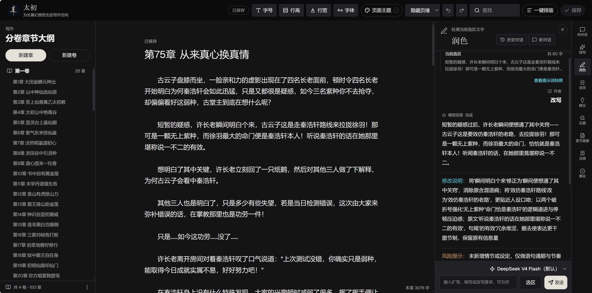
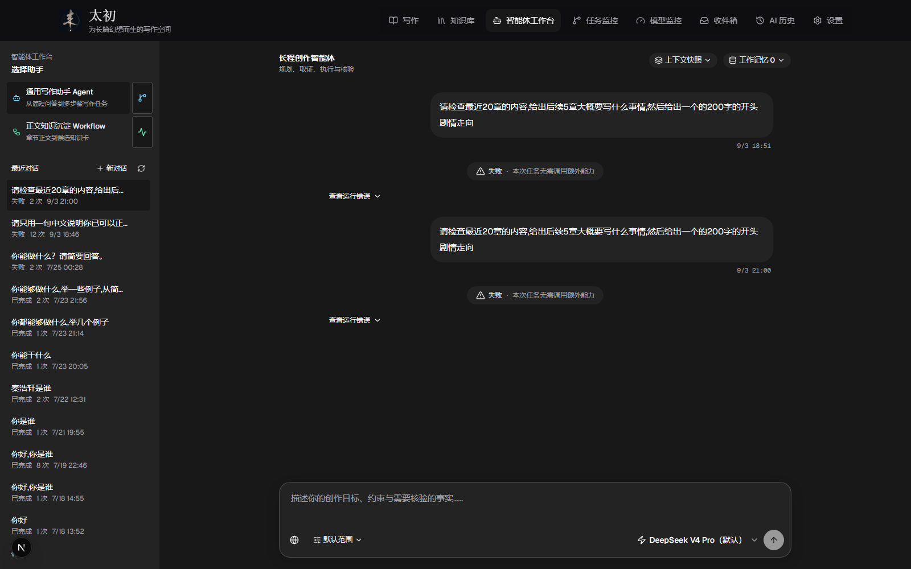
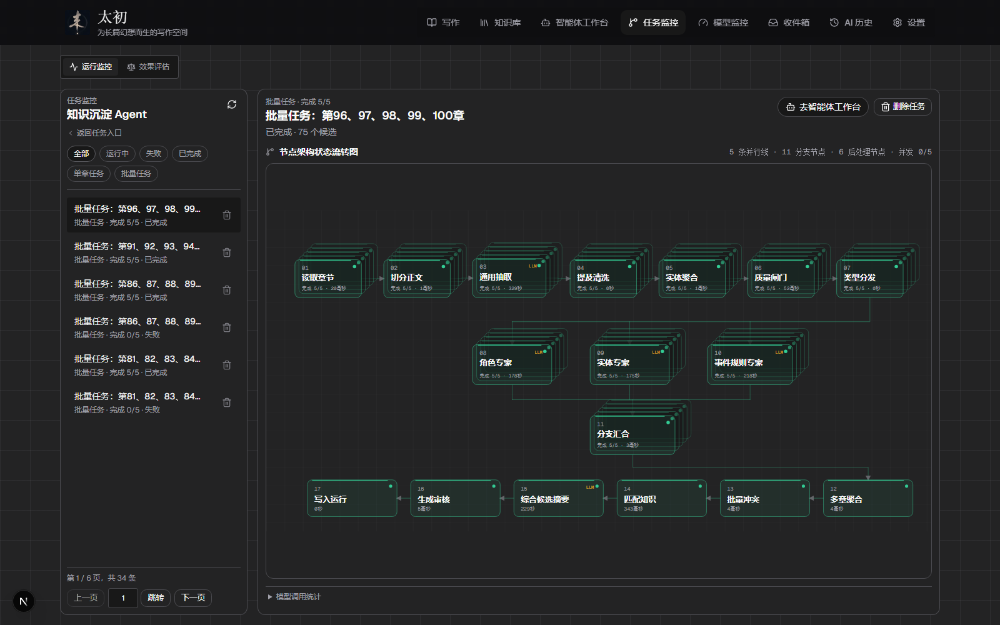
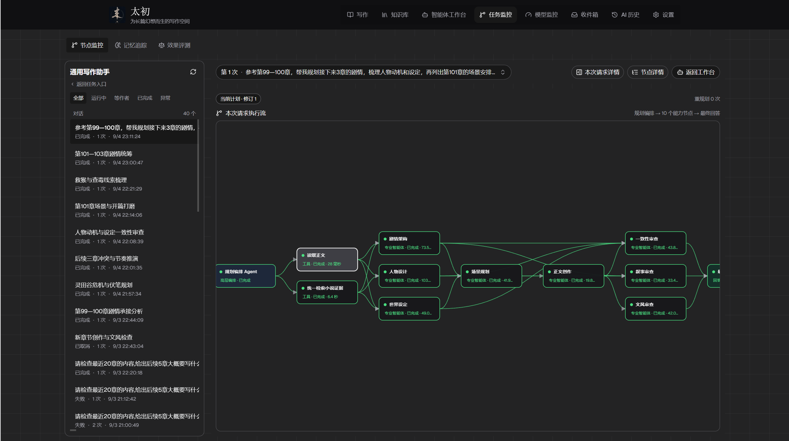
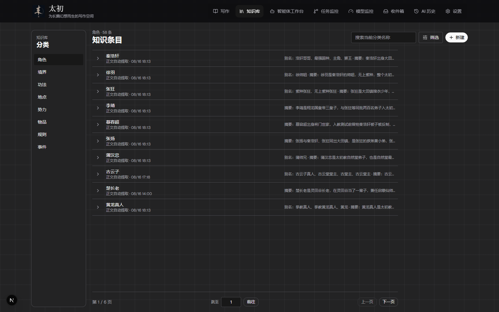
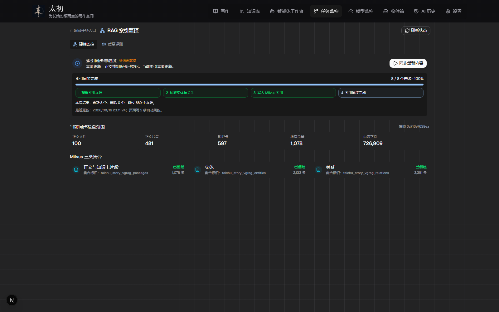
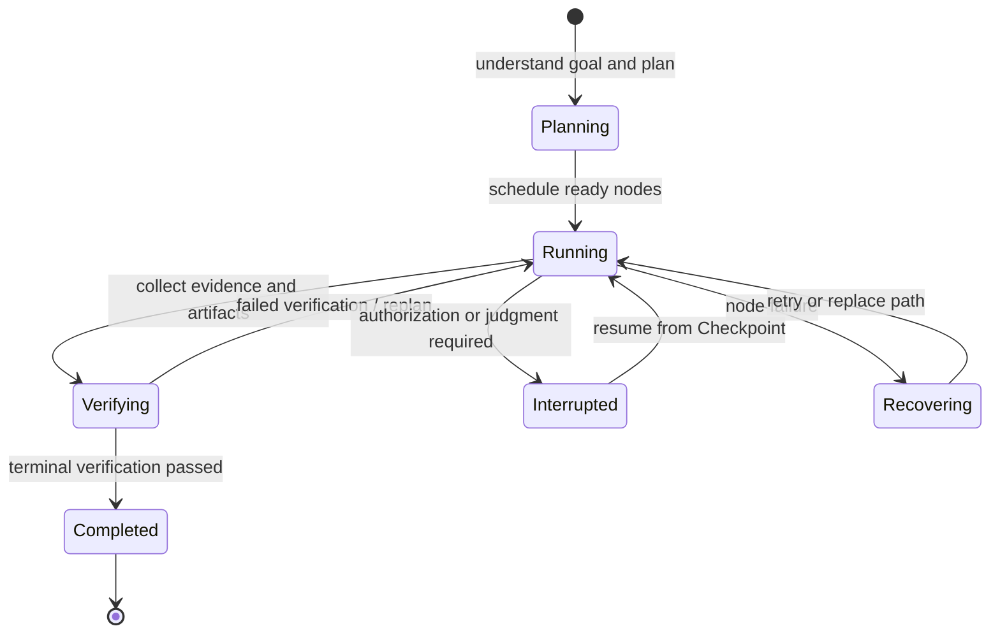
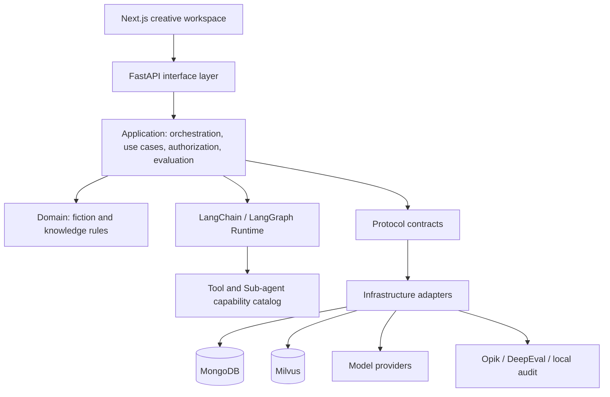
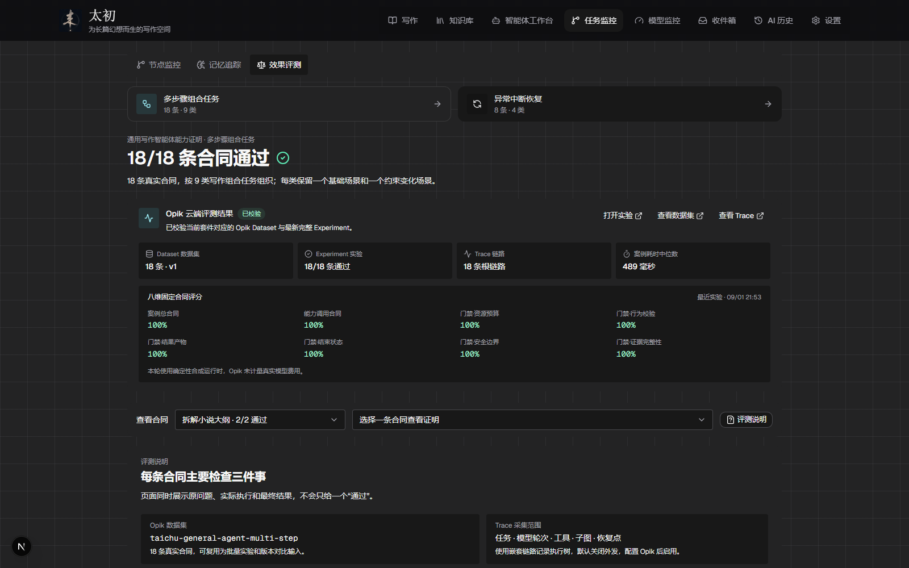

<div align="center">
  <h1 align="center">
    
    &nbsp;Taichu · 太初
  </h1>
  <p><strong>An observable, recoverable, and human-interruptible Agent workspace for long-form fiction.</strong></p>
  <p>面向长篇小说创作的可观测、可恢复、可干预 Agent 工作台</p>

  <p>
    <a href="https://github.com/qingluo201816/taichu">Homepage</a>
    · <a href="./README.md">中文</a>
    | English
  </p>

  <p>
    
    
    
    
    
    
  </p>
</div>

---

> The scarce resource between a human and an Agent is not output tokens. It is understandable, verifiable, and interruptible information bandwidth.

Taichu turns writing, factual retrieval, specialist review, and knowledge maintenance into traceable long-running tasks. Authors do not need to understand the underlying Agent framework to inspect plans, nodes, evidence, memory, cost, and failure causes—or to take control before consequential writes.

Taichu is neither a thin RAG wrapper nor a one-click generation toy optimized for instant gratification. It is a **state-driven, evidence-grounded, human–Agent co-decision runtime** for long-form creation.

## Contents

- [Positioning](#positioning)
- [Product](#product)
- [Agent system design](#agent-system-design)
- [Sources of truth](#sources-of-truth)
- [Engineering evidence](#engineering-evidence)
- [Stack and local run](#stack-and-local-run)
- [Current boundaries and roadmap](#current-boundaries-and-roadmap)

## Positioning

Long-form fiction cannot be completed as a single-prompt generation task. It is a long-term Agent collaboration process spanning millions of words and hundreds of interaction rounds.

The hardest problem is not whether the model can produce one chapter. As chapters, characters, settings, foreshadowing, and creative tasks accumulate, the model must continue solving four classes of problems within a finite context window:

1. **How tasks keep moving forward**: A cross-chapter request may involve plot planning, character-state updates, foreshadowing payoffs, and prose generation at the same time. The system must decompose the work correctly, execute it continuously, and adjust the plan from intermediate results.

2. **How fictional facts remain consistent**: Character relationships, cultivation levels, timelines, and world rules are distributed across manuscript text, knowledge cards, and dialogue history. Retrieval can fail, while context may retain obsolete plans or settings that the author has already changed. The system must distinguish active facts, invalid information, retrieved evidence, and model inference so that incorrect context does not keep contaminating later reasoning and writing.

3. **How human–Agent collaboration continues**: An Agent cannot simply execute without stopping. It must recognize missing information, conflicts, and consequential creative decisions, then pause and ask the author. After author intervention, interruption, or execution failure, it must preserve the current plan and runtime state and resume from the same point instead of replaying the entire creative chain.

4. **What may actually be written into the novel**: Plot analysis and revision suggestions may be generated automatically, but changes to chapter prose, character settings, worldbuilding, and other canonical content require permission control and author confirmation.

The project therefore addresses more than “how to make an LLM write fiction.” It asks **how a probabilistic, context-limited model can continuously understand established plot, preserve factual consistency, know when to collaborate with the author, and advance long-running creative work reliably and under control.**

Taichu builds its product capabilities around these four long-term collaboration problems:

<table align="center" width="72%">
  <thead>
    <tr>
      <th width="18%">Capability</th>
      <th>What the author gets</th>
    </tr>
  </thead>
  <tbody>
    <tr>
      <td>Observable</td>
      <td>Plans, dynamic DAGs, node state, traces, checkpoints, evidence, and cost</td>
    </tr>
    <tr>
      <td>Recoverable</td>
      <td>Checkpoint continuation, localized failure, retry, and replanning</td>
    </tr>
    <tr>
      <td>Interruptible</td>
      <td>Candidate-first workflows and author authorization before durable writes</td>
    </tr>
    <tr>
      <td>Verifiable</td>
      <td>Outputs bound to source scope, retrieved evidence, and author constraints</td>
    </tr>
    <tr>
      <td>Governed</td>
      <td>Explicit boundaries between prose, candidate knowledge, confirmed facts, and derived indexes</td>
    </tr>
  </tbody>
</table>

<p align="center">
  
</p>

## Product

### 1. Source-grounded writing



Ask, continue, polish, summarize, or review a selection, chapter, chapter range, or the full manuscript. AI output is bound to manuscript scope, retrieved evidence, and author constraints. It enters the workflow as a candidate instead of overwriting a source of truth.

The editor currently exposes AI entry points for chat, continuation, polishing, settings, suggestions, evidence, chapter summaries, inspiration, and factual checks.

<details>
<summary><strong>Why this design?</strong></summary>

The author can write, ask, and verify at any moment, but the model does not take ownership of final writes or intent. Taichu is designed to extend thought, not hide its absence behind fluent output.

One warning: **do not outsource judgment to the model.**

</details>

### 2. Observable Agent execution



<table>
  <tr>
    <td width="50%"></td>
    <td width="50%"></td>
  </tr>
  <tr>
    <td align="center">Knowledge extraction workflow</td>
    <td align="center">Run, node, and recovery monitoring</td>
  </tr>
</table>

A high-level Orchestrator plans complex requests as dynamic DAGs, schedules deterministic Tools and specialist Sub-agents by dependency, and converges through Verification / Replan. Plan revisions, node state, traces, checkpoints, failures, and recovery remain inspectable. Durable writes require author authorization.

<details>
<summary><strong>What is it useful for?</strong></summary>

Give Taichu a tangled idea and let it decompose, cross-check, and organize the problem. Use it to inspect setting conflicts, power-scale drift, or cross-chapter inconsistencies, or to extract knowledge-card candidates from recent writing.

Model output can be wrong. Confirm it before it enters the knowledge base—**consume responsibly**.

</details>

### 3. Confirmable, rebuildable knowledge

<table>
  <tr>
    <td width="50%"></td>
    <td width="50%"></td>
  </tr>
  <tr>
    <td align="center">Knowledge-card lifecycle and confirmation</td>
    <td align="center">RAG synchronization, indexes, and retrieval monitoring</td>
  </tr>
</table>

Taichu extracts structured candidates—characters, factions, locations, techniques, and more—from the manuscript. Candidates move through draft, confirmed, or rejected lifecycles. Markdown prose and author-confirmed knowledge cards are sources of truth; Milvus Passage, Entity, and Relation data are deletable, incrementally synchronized, rebuildable derivatives.

<details>
<summary><strong>Why must retrieval be layered?</strong></summary>

Poor retrieval is often a governance problem before it is a model problem. If prose, candidates, confirmed knowledge, and derived indexes share an unclear boundary, generated claims can silently become facts and contaminate later retrieval.

In Taichu, authors edit prose, authors confirm knowledge cards, and vector/graph indexes can always be rebuilt.

</details>

## Agent system design

### Hierarchical planning, not a fixed workflow

Taichu follows **Hierarchical Planning + Subagents**. The high-level Orchestrator retains the global objective, plan, dependencies, budget, verification, and replanning. Tools and Sub-agents register around durable capability boundaries; nodes and edges are generated per run.

Small requests may be answered directly or use one Tool. Complex work may form a dynamic DAG with sequential, parallel, verification, repair, and human-interrupt nodes. The runtime does not force every request through the same long pipeline.

### Execution and recovery



- `conversation_id` maps to the long-lived LangGraph `thread_id`; each request receives a separate business `run_id` for audit.
- Checkpoints preserve graph execution state. Business projections and side-effect ledgers do not replace framework checkpoints.
- Human-in-the-loop resumes the same thread through interrupt/resume semantics rather than a parallel imitation of recovery.
- Durable side effects are constrained by authorization, idempotency, and a single write node.

### Five context layers

Model-visible context is assembled in this fixed order:

```text
System Prompt (stable memory)
→ long-term memory
→ dialogue history
→ working memory
→ current request
```

| Layer | Content | Boundary |
| --- | --- | --- |
| Stable memory | Identity, fixed rules, permissions, static capability index | System Prompt only; optimized as a stable prefix |
| Long-term memory | User expression, writing, collaboration preferences, and feedback | Not the novel knowledge base; recalled per request |
| Dialogue history | Original user messages and displayed assistant responses | Excludes tool traces, DAGs, errors, and budgets |
| Working memory | Current plan, evidence, tool results, node state, recent failures | Projected per stage; full traces are not resent by default |
| Current request | Latest verbatim user input and immutable attachment references | Never rewritten or mixed with application-generated instructions |

Complete storage is not the same as the current model projection. Business ownership is not the same as an API role. Internal Agent traces are not user dialogue history.

### Software architecture



- The domain layer has no dependency on LLMs, Agents, LangGraph, MCP, or storage implementations.
- The application layer targets LangChain `BaseChatModel` and native message, tool-call, and structured-output contracts.
- Provider protocols, authentication, stream translation, usage, and replay belong to infrastructure.
- Discovery and registration are separated; a new Agent joins through a plugin directory and protocol instead of modifying existing capabilities.

## Sources of truth

| Data layer | Role | Source of truth? | Rebuildable? |
| --- | --- | --- | --- |
| Markdown manuscript | Original author expression and chapter prose | Yes, textual truth | No |
| Confirmed MongoDB knowledge cards | Characters, locations, factions, objects, events, and rules | Yes, structural truth | No |
| JSON / JSONL | AI candidates, run audit, evaluation, and replay | No, intermediate state | Depends on purpose |
| Milvus Passage / Entity / Relation | Vector, keyword, and graph retrieval indexes | No, derived layer | Yes |

AI never writes directly to MongoDB. Knowledge follows this path:

```text
model candidate → schema validation → provenance validation → conflict validation
→ lifecycle validation → author confirmation → application write → derived-index sync
```

## Engineering evidence

Taichu verifies “it runs” separately from “it is trustworthy.” The results below come from fixed evaluation suites, recovery benchmarks, and real product evaluation screens in the current repository. They are reproducible engineering evidence—not universal promises about every model, every novel, or literary quality.

### Current validation matrix

| Target | Scale | Current result | What it demonstrates |
| --- | ---: | --- | --- |
| General writing suite | 37 fixed scenario categories | Continuously regressed | Capability coverage and contract stability |
| Multi-step Agent contracts | 18 contracts / 9 task classes | 18 / 18 | Capability choice, budget, behavior, artifacts, terminal state, safety, and evidence |
| Interrupt/recovery contracts | 8 contracts / 4 task classes | 8 / 8 | Checkpointing, recovery, idempotency, and authorization boundaries |
| Recovery stress matrix | 36 combinations | 100% completion, 100% recovery, 0 duplicate successful side effects | 1/3/6/12/20/40 nodes × concurrency 1/3/8 × normal/interrupted runs |
| RAG semantic evaluation | 30 fixed cases | Contextual relevancy 0.8530; faithfulness 0.9933; answer relevancy 0.9526 | Retrieval/answer quality trends and long-tail failure discovery |

The largest checkpoint in the recovery matrix was approximately 7.63 MiB. Current defaults remain 12 nodes, concurrency 3, a 900-second runtime limit, and at most one durable write node per author grant.

### Opik evaluation and tracing



Taichu connects Dataset, Experiment, and Trace records to its local evaluation screen and validates suite hash, version, cases, and completion state. The synthetic runtime shown here proves orchestration, capability invocation, recovery, and evidence contracts. It does not represent live-model cost or literary quality.

- [Opik: official Agent Evaluation documentation](https://www.comet.com/docs/opik/evaluation/evaluate_agents)
- [Opik: official Dashboard documentation](https://www.comet.com/docs/opik/v1/production/dashboards)
- [DeepEval: official Evaluation documentation](https://deepeval.com/docs/evaluation-introduction)

## Stack and local run

| Layer | Technology |
| --- | --- |
| Agent Runtime | LangChain, LangGraph, official Checkpoint / Store / Human-in-the-loop |
| Backend | Python 3.12+, FastAPI, Pydantic |
| Frontend | Next.js, React, TypeScript, Tailwind CSS, shadcn/ui |
| Structural truth | MongoDB |
| Derived retrieval | Milvus, vector + keyword + graph retrieval |
| Evaluation and observability | Opik, DeepEval, local traces and audit data |
| Package management | uv, npm |

### Run locally

```bash
uv sync
cd web
npm install
cd ..
start.bat
```

Then open:

- Frontend: `http://localhost:3000`
- Backend: `http://127.0.0.1:8000`

## Current boundaries and roadmap

### Current boundaries

- The current product focuses on a **single personal xuanhuan-fantasy novel**.
- Multi-novel management, multi-tenancy, and automatic publishing are not current product capabilities.
- AI artifacts are candidates by default; they do not automatically become prose or confirmed knowledge.
- Evaluation proves declared contracts and sample coverage. It does not replace the author’s judgment of fact, voice, or literary quality.

Clear boundaries do not diminish the vision. They make each promise testable.

### 1. Human–Agent alignment

Continue exploring the Human-in-the-loop boundary: what may execute automatically, what should notify, what must wait for authorization, and how to retain maximum control with minimum interruption.

### 2. Creative presentation

- Evolve the novel map into a generated, interactive 3D world view.
- Introduce an opening animation that reflects the fictional world.
- Use multimodal or world models to propose character, scene, and visual-setting concepts.

### 3. Runtime architecture

- Reduce time, token, and provider cost for long chains.
- Explore evaluation-constrained prompt self-evolution.
- Build user, collaboration, and novel profiles inspired by LLM-Wiki-style long-term memory.
- Keep testing multi-model stability and expand long-chain recovery scenarios.
- Add automatic model and tool health detection.
- Bring architectural constraints, evaluation gates, and releases into automated CI/CD.

### 4. Deployment and productization research

Research multi-tenancy, genre switching, automatic publishing, and online deployment. These remain future product directions; the current implementation deliberately preserves a single-novel, single-author workspace boundary.

---

<div align="center">
  <strong>Taichu does not think for you. It makes complex creation legible—and every power delegated to an Agent accountable.</strong>
</div>
