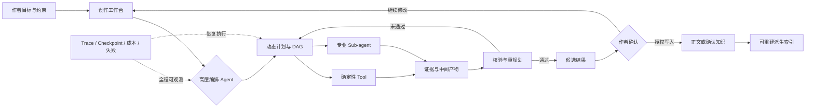
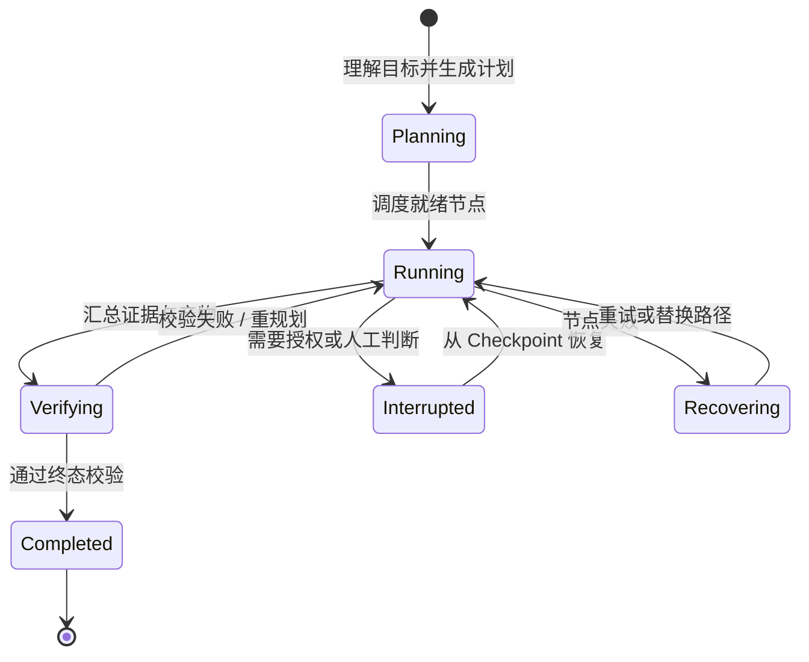
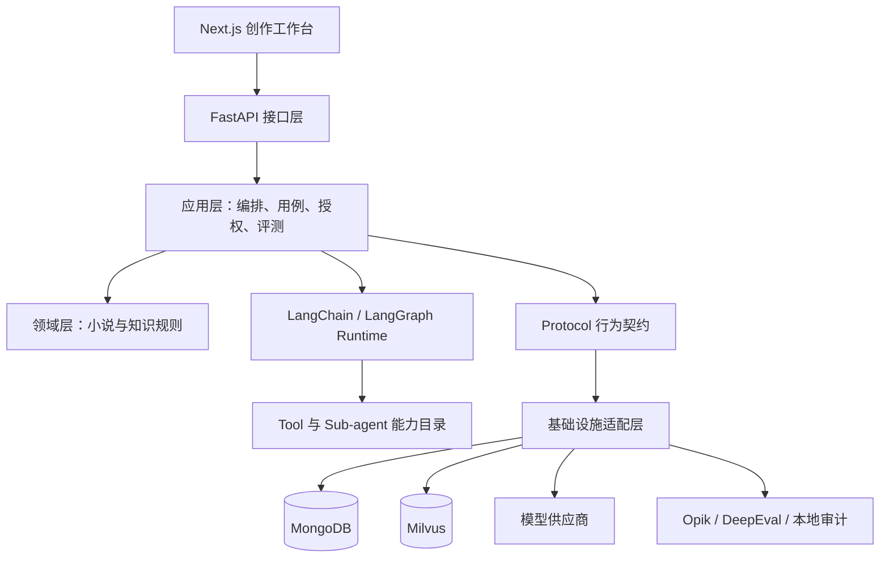

<div align="center">
  
  <h1>太初 Taichu</h1>
  <p><strong>面向长篇小说创作的可观测、可恢复、可干预 Agent 工作台</strong></p>
  <p>An observable, recoverable, and human-interruptible Agent workspace for long-form fiction.</p>

  <p>
    <a href="https://github.com/qingluo201816/taichu">Homepage</a>
    · <a href="./README.md">English</a>
    | 中文
  </p>

  <p>
    
    
    
    
    
    
  </p>
</div>

---

> 人与 Agent 之间真正稀缺的，不是输出 Token，而是可理解、可验证、可干预的信息带宽。

太初把正文创作、事实检索、专业审校和知识沉淀组织为可追踪的长程任务。创作者不需要理解底层 Agent 框架，也能看见计划、节点、证据、记忆、成本与失败原因，并在关键写入前接管执行。

太初不是单纯的 RAG 检索增强应用，也不是追求即时反馈的一键生成玩具。它是一套**状态驱动、证据可信、人机共决**的长程创作运行时。

## 目录

- [产品定位](#产品定位)
- [产品展示](#产品展示)
- [系统概念图](#系统概念图)
- [Agent 系统设计](#agent-系统设计)
- [事实源与知识治理](#事实源与知识治理)
- [工程证据](#工程证据)
- [技术栈与运行](#技术栈与运行)
- [当前边界](#当前边界)
- [进化方向](#进化方向)

## 产品定位

长篇小说不是一次 Prompt 可以完成的任务。它要求系统在几十万字、数百条设定和长期协作中持续回答四个问题：

1. 这次要做什么，计划为什么这样拆？
2. 结论来自哪里，哪些只是模型推断？
3. 中途失败后能否恢复，而不是从头再来？
4. 哪些内容可以自动执行，哪些写入必须由作者确认？

太初围绕这四个问题建立产品能力：

| 核心能力 | 作者看到的结果 |
| --- | --- |
| 可观测 | 计划、动态 DAG、节点状态、Trace、Checkpoint、证据和成本均可查看 |
| 可恢复 | 长任务可从检查点继续，失败节点可定位、重试和重规划 |
| 可干预 | 候选内容先进入审核流程，关键持久化写入由作者授权 |
| 可验证 | 检索证据、作者约束和输出作用域绑定，评测结果可复验 |
| 可治理 | 正文、候选知识、确认知识和派生索引具有明确边界 |

## 产品展示

### 1. 带证据的长篇创作空间


支持按选区、章节、章节范围或全文执行问答、续写、润色、总结与审校。AI 输出与正文作用域、检索证据和作者约束绑定，生成内容先作为候选进入创作流程，不直接覆盖事实源。

当前编辑器已经提供聊天、续写、润色、设定、建议、证据、章节总结、灵感和事实等 AI 入口。

<details>
<summary><strong>为什么要这样设计？</strong></summary>

写作区允许作者随时创作、提问和核验，但模型不替作者完成最终写入，也不替作者承担意图判断。太初希望扩大思考能力，而不是用流畅输出掩盖思考的缺席。

一句忠告：**不要把判断力外包给模型。**

</details>

### 2. 可观测的长程 Agent 执行


<table>
  <tr>
    <td width="50%"></td>
    <td width="50%"></td>
  </tr>
  <tr>
    <td align="center">知识沉淀工作流</td>
    <td align="center">运行、节点与恢复监控</td>
  </tr>
</table>

高层 Orchestrator 将复杂请求规划为动态 DAG，按依赖调度确定性 Tool 与专业 Sub-agent，并通过 Verification / Replan 收敛结果。计划修订、节点状态、Trace、Checkpoint、失败与恢复全过程均可查看；持久化写入前由作者授权。

<details>
<summary><strong>它适合处理什么？</strong></summary>

你可以把脑中的混乱思路交给太初，让它拆解问题、多方取证并整理矛盾；也可以批量检查设定、战力体系和跨章节冲突，或从近期正文中生成待确认的知识卡候选。

大模型生成内容可能有误。请确认后再写入知识库，**请勿贪杯**。

</details>

### 3. 可确认、可重建的知识系统

<table>
  <tr>
    <td width="50%"></td>
    <td width="50%"></td>
  </tr>
  <tr>
    <td align="center">知识卡生命周期与确认</td>
    <td align="center">RAG 同步、索引和检索监控</td>
  </tr>
</table>

系统从正文中抽取人物、势力、地点、功法等结构化候选，经由草稿、确认、废弃生命周期进入知识库。Markdown 正文与作者确认的知识卡是事实源；Milvus 中的 Passage、Entity 和 Relation 是可删除、可增量同步、可重建的派生索引。

<details>
<summary><strong>为什么检索系统必须分层？</strong></summary>

检索效果差，常常不是缺少更大的模型，而是正文、候选知识、确认知识和派生索引的边界不清。当模型生成内容能够绕过确认流程成为事实，错误就会进入后续检索并不断放大。

在太初中：正文由作者编辑，知识卡由作者确认，向量与图索引随时可以重建。

</details>

## 系统概念图



这张图表达的不是固定流水线，而是一条运行原则：**模型负责提出与执行候选路径，系统负责保存状态与证据，作者保留事实写入和方向调整的最终权力。**

## Agent 系统设计

### 分层规划，而非固定工作流

太初采用 **Hierarchical Planning + Subagents（分层规划 + 子 Agent）**。高层编排 Agent 始终维护全局目标、计划、依赖、预算、校验与重规划；Tool 和 Sub-agent 围绕长期稳定的能力边界注册，单次任务的节点与边则按请求动态生成。

小请求可以直接回答或调用一个 Tool；复杂请求可以形成包含顺序、并行、核验、修复和人工中断的动态 DAG。系统不会强迫每个问题进入同一条长流程。

### 运行与恢复



- `conversation_id` 对应 LangGraph 长期会话 `thread_id`；每次请求使用独立 `run_id` 完成业务审计。
- Checkpoint 保存图运行状态；业务投影与副作用账本不替代框架检查点。
- Human-in-the-loop 使用中断与恢复语义延续同一线程，而不是另起一条伪恢复流程。
- 持久化副作用受到授权、幂等和单写节点约束。

### 五层上下文

模型可见上下文严格按以下顺序组装：

```text
System Prompt（稳定记忆）
→ 长期记忆
→ 历史对话
→ 工作记忆
→ 当前请求
```

| 层级 | 内容 | 关键边界 |
| --- | --- | --- |
| 稳定记忆 | 身份、固定规则、权限边界、静态能力索引 | 只进入 System Prompt，保持稳定前缀 |
| 长期记忆 | 用户表达、写作与协作偏好、效果反馈 | 不是小说事实库，按当前请求召回 |
| 历史对话 | 已发生的用户原文与已展示回答 | 不混入工具轨迹、DAG、错误和预算 |
| 工作记忆 | 当前计划、证据、工具结果、节点状态与近期错误 | 按阶段投影，不默认重发完整运行历史 |
| 当前请求 | 最新用户原文和不可变附件引用 | 不改写、不摘要，与系统生成说明隔离 |

完整存储不等于本轮模型投影，业务归属不等于模型 API 角色，Agent 内部调用轨迹也不等于用户历史对话。

### 代码架构



- 领域层不依赖 LLM、Agent、LangGraph、MCP 或具体存储技术。
- 应用层面向 LangChain `BaseChatModel` 与原生消息、工具调用和结构化输出契约。
- 供应商协议、鉴权、流式事件、用量与回放归基础设施层。
- 能力发现与注册分离；新增 Agent 通过插件目录与协议接入，不修改既有能力实现。

## 事实源与知识治理

| 数据层 | 角色 | 是否事实源 | 是否可重建 |
| --- | --- | --- | --- |
| Markdown 正文 | 作者原始表达与章节文本 | 是，文本事实源 | 否 |
| MongoDB 已确认知识卡 | 人物、地点、势力、物品、事件与规则 | 是，结构事实源 | 否 |
| JSON / JSONL | AI 候选、运行审计、评测和回放 | 否，中间态 | 视用途而定 |
| Milvus Passage / Entity / Relation | 向量、关键词与图检索索引 | 否，派生层 | 是 |

AI 不直接写入 MongoDB。知识内容必须经过：

```text
模型生成候选 → Schema 校验 → 来源校验 → 冲突校验
→ 生命周期校验 → 作者确认 → 应用层写入 → 派生索引同步
```

## 工程证据

太初把“能跑”与“可信”分开验证。以下数据来自当前仓库的固定评测集、恢复基准和真实产品评测页面；它们是可复验的工程证据，不是对所有模型、所有小说或文学质量的普遍承诺。

### 当前验证矩阵

| 验证对象 | 规模 | 当前结果 | 证明范围 |
| --- | ---: | --- | --- |
| 通用写作能力集 | 37 类固定场景 | 固定样例持续回归 | 写作请求的能力覆盖与契约稳定性 |
| 多步骤 Agent 合同集 | 18 个合同 / 9 类任务 | 18 / 18 | 能力选择、预算、行为、产物、终态、安全和证据链 |
| 中断恢复合同集 | 8 个合同 / 4 类任务 | 8 / 8 | Checkpoint、恢复、幂等与授权边界 |
| 恢复压力矩阵 | 36 个组合 | 完成率 100%，恢复率 100%，重复成功副作用 0 | 1/3/6/12/20/40 节点、并发 1/3/8、正常与中断两种模式 |
| RAG 语义评测 | 30 个固定样例 | 上下文相关性 0.8530；忠实度 0.9933；答案相关性 0.9526 | 检索与回答质量趋势、失败尾项定位 |

恢复压力矩阵中，最大 Checkpoint 约为 7.63 MiB。当前默认运行边界保持为 12 个节点、并发 3、运行时限 900 秒，并坚持每次作者授权最多一个持久化写节点。

### Opik 评测与追踪


太初将 Dataset、Experiment 与 Trace 关联到本地评测页面，并校验评测套件哈希、版本、样例和完成状态。截图中的合成运行时用于证明编排、能力调用、恢复与证据契约，不代表真实模型成本，也不等价于文学质量评判。

- [Opik：Agent Evaluation 官方文档](https://www.comet.com/docs/opik/evaluation/evaluate_agents)
- [Opik：Dashboard 官方文档](https://www.comet.com/docs/opik/v1/production/dashboards)
- [DeepEval：Evaluation 官方文档](https://deepeval.com/docs/evaluation-introduction)

### 长上下文退化案例

一次 `deepseek-v4-flash-0731` 长链路运行暴露了明显的重复生成退化：

| 阶段 | 累计上下文 | “让我”出现次数 / 输出字符 | 症状 |
| --- | ---: | ---: | --- |
| 初期（idx 46） | 15K tokens | 11 / 2,213 | 轻微多余 |
| 中期（idx 196） | 71K tokens | 50 / 4,290 | 明显退化 |
| 恶化（idx 404） | 162K tokens | 61 / 4,279 | 严重重复 |
| 崩溃（idx 446） | 181K tokens | 636 / 17,551 | 完全循环 |
| 再次崩溃（idx 459） | 183K tokens | 1,165 / 19,363 | 概率分布彻底坍塌 |

典型输出退化为“让我看。让我执行。让我用 grep……”的无工具调用循环。

该事件说明：长程 Agent 的可靠性不能只依赖模型标称上下文窗口。模型能力退化与上下文管理缺少截断、刷新和循环检测会形成正反馈。因此太初把工作记忆投影、Checkpoint、失败检测、恢复基准和模型健康状态视为运行时能力，而不是 Prompt 技巧。

## 技术栈与运行

| 层级 | 技术 |
| --- | --- |
| Agent Runtime | LangChain、LangGraph、官方 Checkpoint / Store / Human-in-the-loop |
| 后端 | Python 3.12+、FastAPI、Pydantic |
| 前端 | Next.js、React、TypeScript、Tailwind CSS、shadcn/ui |
| 结构事实 | MongoDB |
| 派生检索 | Milvus、向量 + 关键词 + 图检索 |
| 评测与观测 | Opik、DeepEval、本地 Trace 与审计数据 |
| 包管理 | uv、npm |

### 本地启动

```bash
uv sync
cd web
npm install
cd ..
start.bat
```

启动后访问：

- 前端：`http://localhost:3000`
- 后端：`http://127.0.0.1:8000`

环境变量、目录职责与开发约束请查看开发者仓库地图 [myreadme.md](./myreadme.md)、`.env.example` 与 `AGENTS.md`。

## 当前边界

- 当前聚焦**单本玄幻小说**的个人写作场景。
- 当前不提供多小说管理、多租户隔离和自动发布。
- AI 产物默认是候选，不自动成为正文或确认知识。
- 评测证明的是已声明合同与样例范围，不替代作者对事实、风格和文学质量的判断。

明确边界不是缩小愿景，而是让每一层承诺都能被验证。

## 进化方向

### 1. 人机对齐

继续探索 Human-in-the-loop 的边界：什么可以自动执行，什么需要提示，什么必须等待作者授权，以及怎样以最低干扰保留最高控制权。

### 2. 创作展示

- 将小说地图演进为可生成、可交互的 3D 世界展示。
- 为太初首页引入与创作世界相呼应的开屏动画。
- 使用多模态模型或世界模型生成角色形象、场景与视觉设定候选。

### 3. 架构优化

- 优化长链路的时间、Token 与调用成本。
- 探索受评测约束的 Prompt 自进化。
- 以 LLM-Wiki 思想构建用户、协作和小说画像的长期记忆。
- 持续验证多模型接入稳定性，扩展长链路任务与恢复场景。
- 建立模型与工具健康状态自动检测系统。
- 将架构约束、评测门禁与发布流程纳入自动化 CI/CD。

### 4. 部署与产品化研究

调研多租户、多类型小说切换、自动发布和线上部署方案。这些属于未来产品化方向；当前实现仍坚持单本小说、单作者工作台的清晰边界。

---

<div align="center">
  <strong>太初不替你思考。它让复杂创作更清楚，让每次交给 Agent 的权力都有迹可循。</strong>
</div>


