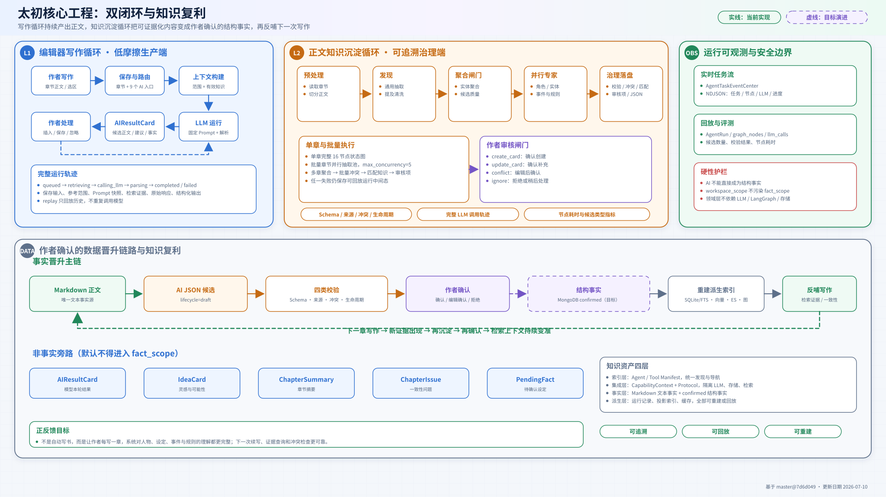

# 太初系统架构图

> 更新日期：2026-07-10
>
> 代码基线：`master@7d6d04904802b9c7ad34f96768b02e1ab04d32c5`
>
> 状态：临时架构快照，包含当前实现与目标演进，不作为已全部落地的承诺。

## 交付内容

### 1. 系统架构总览

从产品体验层、FastAPI 接口层、两条应用闭环、基础设施层和数据宪法五个层面展示太初当前架构，并明确区分当前实现和目标演进。

- [高清 PNG](太初系统架构总览.png)
- [可编辑 SVG](太初系统架构总览.svg)
- [Mermaid 语义源文件](太初系统架构总览.mmd)

### 2. 双闭环与知识复利

重点展示编辑器轻量写作循环、正文知识沉淀 Agent、作者审核闸门、事实晋升链路、非事实旁路和派生索引反哺关系。

- [高清 PNG](太初双闭环与知识复利.png)
- [可编辑 SVG](太初双闭环与知识复利.svg)
- [Mermaid 语义源文件](太初双闭环与知识复利.mmd)

## 仓库探索依据

架构图不是按参考图套壳，而是从当前代码反推，主要依据如下：

| 结论 | 代码依据 |
|---|---|
| 前端存在写作、收件箱、知识、AI 历史、智能体工作台和任务监控等独立入口 | `web/src/app/`、`web/src/components/` |
| FastAPI 是统一服务边界，`main.py` 是唯一组合根 | `src/taichu/main.py`、`src/taichu/api/router.py` |
| 写作区九个 AI 入口共用真实模型调用、上下文构建、固定 Prompt 和运行轨迹 | `writing_ai_service.py`、`writing_ai_prompts.py`、`writing_ai.py` |
| 轻量写作闭环会生成 AIResultCard、IdeaCard 和 PendingFact | `ai_card_service.py`、`inbox_service.py`、`pending_fact_confirmation_service.py` |
| 正文知识沉淀 Agent 是 LangGraph 插件，存在单章完整图和批量并行图 | `application/agents/knowledge_extraction/`、`knowledge_extraction_service.py` |
| 当前单章图包含预处理、通用抽取、质量闸门、三类专家、校验、冲突、匹配、审核和中间态写入 | `knowledge_extraction/workflow.py` |
| 批量抽取章节并发上限为 5，并在统一后处理中聚合、查冲突、匹配知识和构建审核项 | `knowledge_extraction_service.py` |
| 任务状态通过 NDJSON 持续推送，运行中间态包含节点、LLM 调用、候选和指标 | `agent_tasks.py`、`agent_task_event_service.py`、`agent_run.py` |
| 当前可用 LLM 为 DeepSeek，经 LangChain 适配；无配置时使用不可用模型保护 | `infrastructure/llm/`、`config.py` |
| 当前检索是 SQLite FTS 投影，可从源资产清空重建 | `sqlite_fts.py`、`projection_rebuilder.py`、`index_service.py` |

## 当前实现与目标架构边界

| 能力 | 当前实现 | 目标或预留 | 图中表达 |
|---|---|---|---|
| 文本事实源 | 章节 Markdown | 保持不变 | 绿色实线框 |
| 结构化知识仓库 | `JSONKnowledgeRepository` 兼容实现 | MongoDB 中 `lifecycle=confirmed` 的结构事实 | JSON 为实线；MongoDB 为紫色虚线 |
| Agent 中间态 | `derived/agent_runs/knowledge_extraction/*.json` | 保持 JSON 先行，完善 lifecycle 统一 | 橙色实线框 |
| 工作区非事实 | AI 卡片、灵感、摘要、问题、待确认事实 JSONL | 继续与 fact_scope 隔离 | 蓝色旁路 |
| 检索 | SQLite FTS + SourceRef | Vector / Elasticsearch / Graph 等可重建投影 | Generated 派生层 |
| 模型 | DeepSeek | 通过工厂与协议扩展其他模型 | LLM 适配卡 |
| 运行机制 | 单章、批量并发、后台任务、NDJSON 事件 | 更完善的队列、恢复与重试策略 | 当前仅画已实现能力，不虚构任务队列 |

## 架构设计结论

1. 太初的核心不是“一个万能对话 Agent”，而是编辑器内轻量写作闭环与独立知识沉淀 Agent 双闭环。
2. AI 输出默认只是候选或工作区资产；只有通过校验并经作者确认，才能晋升为结构事实。
3. `fact_scope` 只读取正文和已确认知识，灵感、摘要、AI 卡片、问题和待确认事实不能污染事实上下文。
4. Agent、Tool、存储、检索和 LLM 都通过应用层协议和 CapabilityContext 解耦；新增 Agent 应继续采用插件目录 + Manifest + Graph 的方式。
5. SQLite/FTS、向量、ES、图索引和缓存都属于可重建派生层，不能反向成为主数据。
6. “知识复利”来自作者持续写作、Agent 抽取证据、作者确认、索引重建和下一轮检索反哺，而不是让模型自动写书或自动写入事实库。

## 图例

- 绿色：事实链、作者确认后的可靠输入、当前已实现能力。
- 蓝色：写作体验、工作区资产和非事实旁路。
- 橙色：Agent 运行、中间态、校验和治理节点。
- 紫色：作者审核、专家分支或目标架构。
- 灰色：基础设施和可重建派生层。
- 实线框：当前代码已实现或已有兼容实现。
- 虚线框：目标架构或尚未落地的演进方向。
