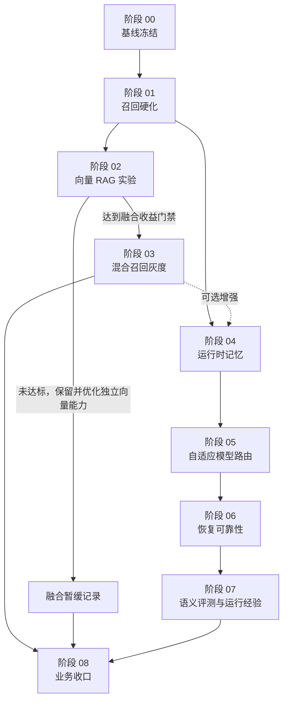

# 修正后的推进路线图

> 更新日期：2026-07-18
> 状态：任务执行路线，不是仓库当前规则源。

## 一、推进原则

- 依赖关系优先于时间排期；不提供工时、人数和日期估算。
- 先度量、后替换；先影子、后灰度；先可回退、后扩大消费者。
- 生产路径只接入通过评测门禁的能力。
- 实验失败可以产生 `NO-GO` 结论，不能伪装成上线成功。
- 所有新能力必须接入现有应用层契约、技术遥测、Runtime 检查点和独立评测。
- 每个阶段内部必须完成实现、测试、评测、自检、文档和回滚演练。
- 阶段间默认连续推进，不设置“必须等用户确认”的暂停点。
- Git 提交和推送仍需要用户另行授权。

## 二、阶段总览

| 阶段 | 主题 | 主要结果 | 依赖 |
|---|---|---|---|
| 00 | 基线冻结与缺口审计 | 可复现测试基线、能力盘点、风险清单 | 无 |
| 01 | 统一召回硬化与评测地基 | 可配置策略、离线评测、兼容遥测、直读防回归 | 00 |
| 02 | 向量 RAG 独立能力 | Qdrant 索引、Embedding 契约、向量后端、实验报告与持续优化基线 | 01 |
| 03 | 混合召回接入与灰度 | RRF/混合策略、影子模式、稳定收益后生产接入 | 02 完成且融合门禁达标；未达标则暂缓融合 |
| 04 | 运行时记忆与上下文压缩 | 多轮承接、结构化记忆、上下文预算、透明管理 | 01；03 可选 |
| 05 | 自适应模型路由 | 可审计路由决策、健康回退、质量/成本/延迟策略 | 00、04 |
| 06 | 检查点恢复可靠性与长链路基准 | 修订历史、副作用对账、故障注入、支持上限 | 04、05 |
| 07 | 语义评测与长期运行经验 | 人工校准语义裁判、经验候选、策略闭环 | 05、06 |
| 08 | 业务收口与治理 | 灰度扩大、监控告警、保留策略、最终支持矩阵 | 前述完成或 NO-GO |

## 三、依赖图

## 四、晋级门禁

### 向量 RAG 进入融合与生产灰度的门禁

必须同时满足：

- 使用真实 Embedding 能力，不接受随机向量、哈希向量或仅用于单测的假实现作为生产证据。
- 评测集至少覆盖精确名称、别名、语义改写、状态关系、多实体和无答案查询。
- 语义改写子集 `Recall@5` 比词法基线提升至少 8 个百分点。
- 全集 `nDCG@5` 不得比词法基线下降超过 1 个百分点。
- 无答案误召回率不得比词法基线增加超过 2 个百分点。
- 身份匹配和目录读取继续走确定性路径，不因向量接入回归。
- 任何情况下只返回 `lifecycle=confirmed` 的 MongoDB 知识卡。
- 索引缺失、过期、损坏或 Embedding 不可用时，100% 回退到词法路径。
- 至少三次重复评测结果稳定，指标波动有记录。

未达到时，阶段 03 不得接入生产；阶段 02 的独立向量能力仍须保留，记录问题、优化方向和重新评测条件。

### 记忆晋级门禁

- 记忆只服务通用 Runtime，不改变写作区单步任务与知识沉淀 Workflow。
- 记忆内容具有来源、范围、生命周期和可删除性。
- 事实类内容只保存来源引用或可重新验证的摘要，不把 AI 摘要升级为事实。
- 相同输入、相同检查点和相同策略快照必须选择相同上下文。
- 长对话压缩后，作者硬约束、未解决问题和来源引用零丢失。
- 跨会话隔离测试通过，不能串用无关记忆。

### 模型路由晋级门禁

- 路由是确定性策略，不用另一个 LLM 随机选择模型。
- 显式角色固定配置仍是最高优先级的硬覆盖。
- 安全、授权和事实边界评测不得下降。
- 通用 Agent 核心评测总体分不得下降超过 2 分，关键安全项不得出现新增失败。
- 在低风险任务集上，费用或 p50 延迟至少一项改善 10%，另一项不得显著恶化。
- 429、超时、5xx 和模型不可用故障注入中的兼容回退成功率达到 95% 以上。
- 每次决策都有路由 ID、策略快照、候选、选择原因和回退原因。

### checkpoint / resume 晋级门禁

- 所有确定性本地写 Tool 在故障注入矩阵中不得产生重复写入或静默覆盖。
- 外部调用结果无法确定时必须进入 `needs_reconciliation` 或人工处理，不得假设成功或失败。
- 最新快照损坏时可以回退到最近一个校验通过的修订。
- 运行恢复后不重复执行已确认成功节点。
- 写入授权不得扩大原 Tool、输入哈希或资源范围。
- 发布最大稳定节点数、不同并发度成功率、恢复成功率和失败类型分布；不凭默认上限宣称稳定支持。

### 语义裁判晋级门禁

- 使用独立裁判角色，不能让被评模型直接给自己打分。
- 有人工标注校准集和盲测集。
- 分类型关键维度与人工的 Cohen’s kappa 不低于 0.65。
- 连续质量分与人工排序的 Spearman 相关不低于 0.70。
- 重复评测一致率不低于 85%。
- 未达标时只保留“辅助复核”，不得把语义分数作为自动上线或策略晋级依据。

## 五、失败分支

- 向量未达标：生产继续使用词法召回，独立向量链路保留并继续优化，阶段 03 暂缓；阶段 04—08照常推进。
- 自适应路由未达标：保留静态 `ModelRoleRouter`，只上线健康回退或可观测部分。
- 语义裁判未达标：保留确定性评测与人工复核，不自动调 Prompt 或路由。
- 长期经验未达标：只保存候选与证据，不把候选注入生产策略。
- 恢复基准未达标：降低产品节点上限、并发上限或禁用不安全写 Tool 的自动恢复。

## 六、最终完成定义

路线图完成不等于所有实验都必须上线。最终应交付一份真实支持矩阵，明确：

- 当前生产召回策略及回退路径。
- Embedding 模型、索引快照和重建方式。
- Runtime 记忆范围、保留期、压缩预算和作者控制。
- 各模型角色的路由策略和故障回退。
- 可稳定支持的最大任务节点数、并发度和恢复边界。
- 哪些任务已由语义评测覆盖，哪些仍需人工复核。
- 长期运行经验如何确认、撤销和影响策略。
- 所有派生数据的保留、删除、脱敏和重建规则。
